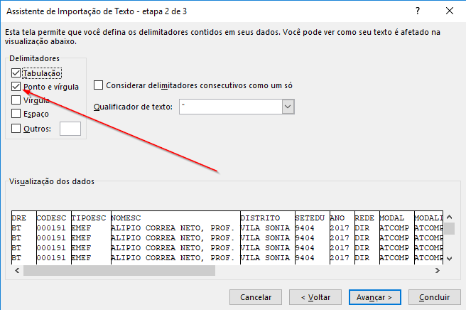

# Introdução ao Excel

Tópicos a serem cobertos

* O que é uma planilha?
    Morfologia básica
    
* Importando conjunto de dados

## O que é uma planilha? 

A planilha - ou em inglês _spreadsheet_ -  é uma aplicação de software que tem como finalidade salvar e organizar dados em linhas e colunas.

Usaremos a versão 2016 do Excel neste tutorial, mas tudo deve ser equivalente para outras versões.

Alguns dos elementos presentes na tela inicial do Excel.

1. Células.
2. Linhas - indicadas por números.
3. Colunas - indicadas por letras.
4. Barra de fórmulas.
5. Faixa de opções.
6. Nome da planilha atual.

## Importando conjuntos de dados

### Baixando os dados
Vamos começar importando um conjunto de dados para nosso trabalho.

Primeiramente, acesse [a página de dados abertos da prefeitura](http://dados.prefeitura.sp.gov.br/organization/educacao1). Nela existem diversos bancos de dados. 

Para o nosso tutorial, usaremos o conjunto de dados [Perfil dos educandos ](http://dados.prefeitura.sp.gov.br/dataset/perfil-dos-educandos-cor-raca-idade-sexo-necessidades-educacionais-especiais)

Nesta página, encontramos três arquivos: dicionário, em que consta uma explicação das siglas; e dois arquivos de extensão .csv - extraídos em 2017 e  2016.

Clique em explorar e selecione a opção Baixar.

Repare que existem dois tipos de arquivo, o de extensão .CSV e o .XLSX

Os arquivos .CSV são de "valores separados por vírgulas". São dados em tabelas salvos como arquivos de texto.

Já os arquivos .XLSX ou .XLS são nativos do Excel.

Não entraremos em mais detalhes por enquanto, o importante é que é possível editar ambos os tipos de arquivo com o Excel.

## Abrindo o arquivo

### Opção 1 - abrir em um novo arquivo

Se você ainda não tem um arquivo de excel em que esteja trabalhando, pode ser mais prático apenas abrir o arquivo e deixar que o excel faça a importação automaticamente.

Simplesmente abra a pasta em que você tenha feito o download do arquivo e dê um click duplo sobre ele.

Se você já tiver o excel instalado em seu computador, ele avaliará o arquivo .csv como uma planilha e fará todo o processo automaticamente.

Ao final, você terá uma tela parecida com esta:

### Opção 2 - importar

Se você já tem uma planilha em que esteja trabalhando e deseja importar esse novo conjunto de dados:

* clique na aba "Dados".
* selecione a opção "Obter dados externos".
* escolha "de texto"

Escolha o arquivo que deseja importar; no nosso caso, idadeserieneeracadez17.csv, cujo download fizemos na sessão anterior.

Aparecerão 3 telas do assistente de importação.

1. Selecione "delimitado" e "Meus dados possuem cabeçalhos". Clique "Avançar >".

2. Selecione "Ponto e vírgula". Clique "Avançar >".

3. Finalmente, apenas clique "Concluir".

4. Na tela "Importar dados", você pode selecionar: coletar os dados na planilha existente ou em uma nova planilha. Neste momento, selecionaremos a planilha existente.

Depois de finalizado esse processo, sua planilha deve parecer com algo similar a isto:

