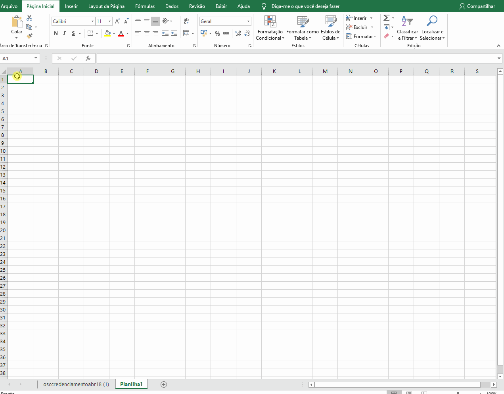
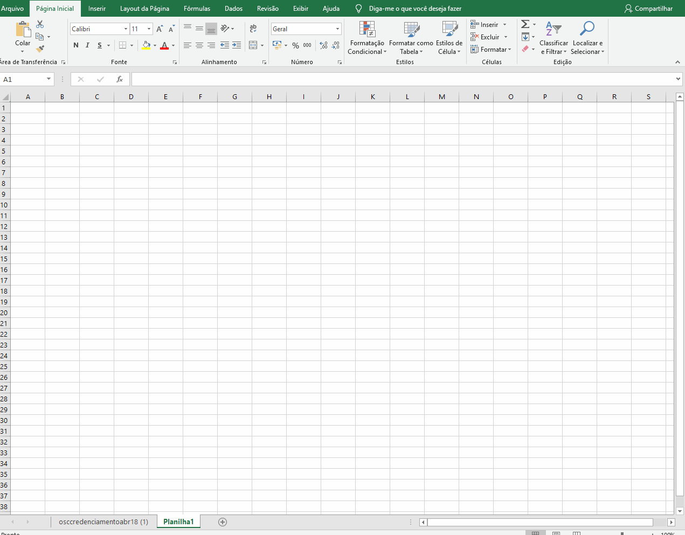
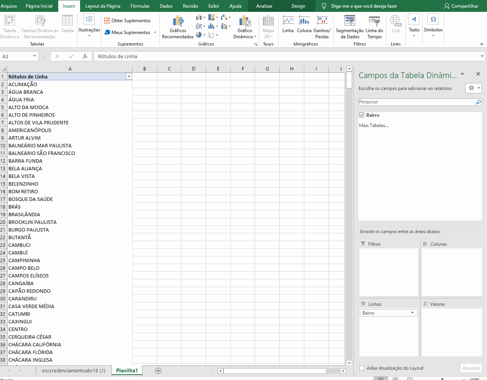
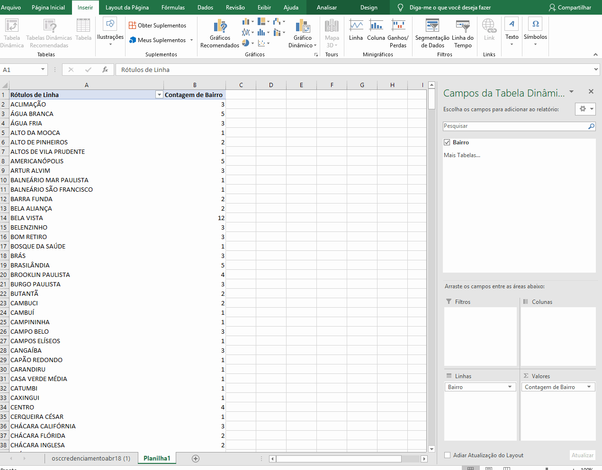
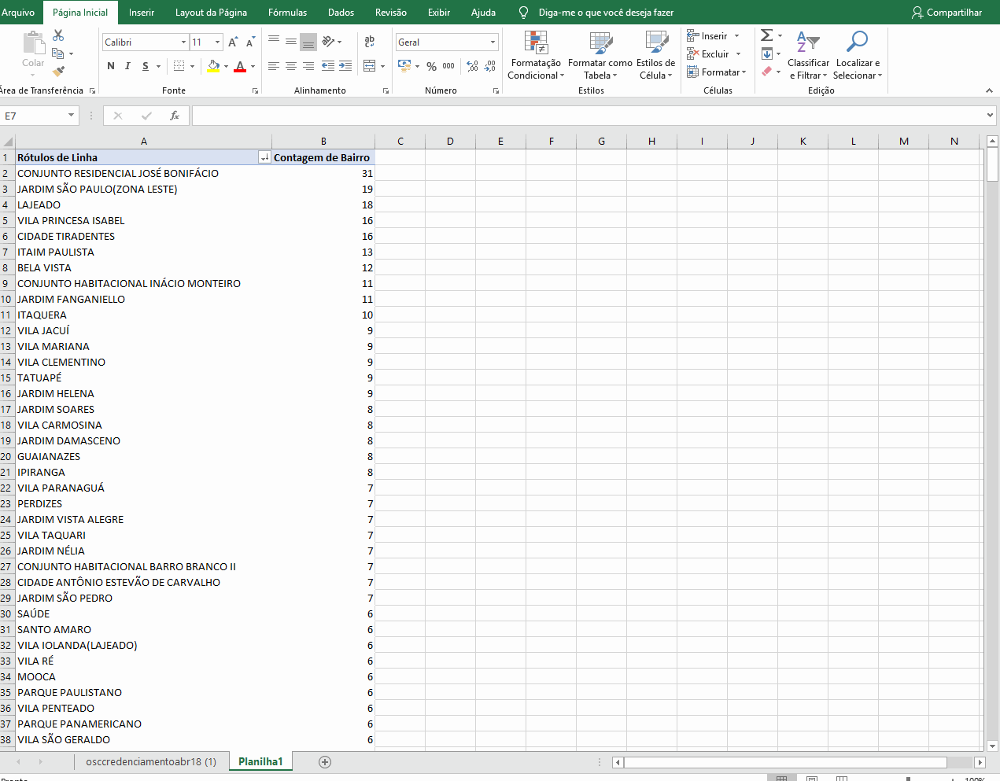
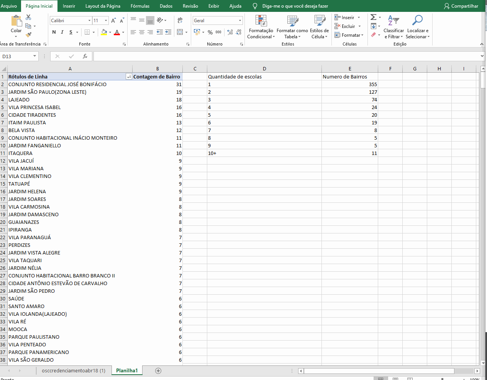

 
# GRÁFICOS

Gráficos são ferramentas muito poderosas. Com eles, somos capazes de visualizar mais facilmente mesmo os mais complexos conjuntos de dados.

Tópicos a serem abordados:

* Criando um gráfico de pizza simples

* Customizando o gráfico

* Criando um gráfico de barras

## Criando um gráfico de pizza simples

Utilizando os dados que coletamos no tutorial anterior -  número total de meninos e meninas -  criaremos um gráfico de setores simples.

Inserir gráficos no excel pode ser bastante simples.

* Se você ainda não o fez, crie duas células com os nomes "TOTAL DE MENINAS" e "TOTAL DE MENINOS", ao lado dos valores correspondentes

* Selecione as 4 células, clicando sobre uma delas e arrastando até as outras

* Na parte superior da tela, selecione a opção "Inserir"

* Selecione "Inserir gráfico de pizza ou rosca"

O excel irá gerar automaticamente o gráfico referente para você.

## Customizando o gráfico

Vejamos agora como mudar a aparência do nosso gráfico.

Primeiro vamos mudar o título do gráfico.

* Clique no gráfico e, em seguida, clique duas vezes sobre o título do gráfico para alterá-lo.

Podemos também alterar o visual geral do gráfico.

* Clique duas vezes sobre o gráfico e escolha uma das opções apresentadas

Finalmente, podemos escolher as cores que serão utilizadas em nossos setores.

* Clique com o botão direito sobre um setor, selecione a opção preenchimento e escolha a cor desejada

## Criando um gráfico de barras

Vamos ver agora como criar um gráfico de barras. Para isso, vamos importar a base de dados ["Organizações credenciadas para atendimento da educação infantil"](http://dados.prefeitura.sp.gov.br/dataset/organizacoes-credenciadas-para-atendimento-da-educacao-infantil).

Vamos verificar a distribuição de instituições credenciadas, por bairro.

### Função CONT.SE
A função CONT.SE é bastante útil e pode nos informar o número de células que atendem a algum critério. Suponhamos, como exemplo, que desejamos contar o número de células que contenham o nome do bairro "BROOKLIN PAULISTA" na coluna "Bairro".
Temos um número enorme de dados, mas essa análise fica muito simples com a função CONT.SE.

Primeiramente, criaremos uma nova planilha, para organizarmos nossas análises. Clicamos no botão +, localizado na parte inferior da nossa tela.

Uma nova aba vai se abrir. Podemos clicar duas vezes sobre ela para renomeá-la. Vamos chamá-la de análises.

* Selecionamos uma célula e digitamos o símbolo de =
* Digitamos CONT.SE. Perceba que o excel começa a mostrar opções conforme se digita, não sendo necessário digitar o comando inteiro.
* Clique duas vezes sobre o nome CONT.SE, para inserir a fórmula na célula.

Conforme aparece na tela, o comando CONT.SE recebe dois argumentos:

	=CONT.SE (Intervalo; Critérios)
	=CONT.SE (Onde você quer procurar?; O que você quer procurar?)
 
Queremos procurar quantas vezes "Brooklin Paulista" está presente na coluna "Bairro da planilha. Então, vamos inserir esses dois argumentos na nossa fórmula.

Depois de inserir a CONT.SE na célula, selecionaremos agora os argumentos.

Primeiro, selecionaremos as células que nos interessam. Nesse caso, as informações estão na coluna 'Bairro". Queremos selecionar a coluna em sua totalidade. 

* Vamos clicar na planilha "osccredenciamentoabr18" e clicar sobre o "H" que marca a coluna.

Automaticamente, a fórmula que estamos criando, escrita na barra de fórmula, já foi preenchida com o argumento "'osccredenciamentoabr18 (1)'!H:H", que indica que desejamos analisar a coluna H da planilha "osccredenciamentoabr18" em sua totalidade.

Agora, precisamos preencher o segundo argumento da função, que, nesse caso, é o que queremos contar. 

* Clicamos na barra de fórmulas e adicionamos um ponto e vírgula.

O ; indica que vamos agora inserir o próximo argumento. Nesse caso, queremos contar o número de ocorrências de "BROOKLIN PAULISTA"

* Inserimos BROKLIIN PAULISTA aspas, assim o excel contará todas as ocorrências dessa frase na coluna H.

* Colocamos então um fecha parênteses no fim da fórmula e damos enter.

O valor que aparece, 4, mostra que existem 4 ocorrências de "BROOKLIN PAULISTA" na coluna Bairro.

### TABELA DINÂMICA

Vamos supor agora que desejamos repetir a operação que realizamos com o CONT.SE, mas que queremos isso para todos os bairros.

A maneira mais simples de realizar essa tarefa, e utilizando uma tabela dinâmica.

* Clique em Inserir -> Tabela Dinâmica

* Mantenha as configurações padrões e selecione a coluna H da planilha osccredenciamentoabr18  em sua totalidade e clique 'OK'

* Selecione "BAIRRO" na caixa de diálogo da Tabela Dinâmica

* Arraste "Bairro" para o campo "Valores"

* Uma nova coluna aparecerá, mostrando a contagem das ocorrências de cada bairro

Caso seus valores não estejam correspondendo, certifique-se que que a contagem está sendo mostrada, clicando com o botão direito na primeira opção do campo "Valores", selecionando "configurações do campo valor" e escolhendo "Contagem"

Finalmente, podemos ordenar a tabela dinâmica.

Inicialmente, ela está ordenada por ordem alfabética dos nomes dos Bairros, mas podemos ordenar pela quantidade da contagem.

* Vamos clicar na seta ao lado de "Rótulos de Linha" e selecionar 'Mais Opções de classificação'

* Selecionar Decrescente e na caixa selecionar "Contagem de bairro"

### Criando o gráfico de barras

A partir dos dados, é bastante simples criarmos um gráfico.

Vamos criar um gráfico de barras, mostrando os nomes dos bairros que tem 10 ou mais organizações.

Vamos primeiro copiar os dados de interesse da tabela dinâmica para uma outra célula.

Feito isso, selecionamos essa cópia, vamos em Inserir -> Gráfico de barras.

Com o gráfico já criado, podemos customizar sua aparência, título, cores etc.

Podemos ainda fazer uma outra analise, utilizando a funcao CONT.SE

Vamos verificar quantos bairros tem 1 escola, quantos tem 2 e assim por diante.

Podemos usar o CONT.SE para agrupar esses dados.

Vamos criar uma coluna com as categorias em que queremos agrupar nossos dados. Neste caso, serão valores de 1 a 10.

Na coluna do lado, iremos inserir a formula CONT.SE

    =CONT.SE(B:B; D2)    

Assim, será contada a célula na coluna B se o seu valor corresponder ao valor contido em D2.

Copiamos a mesma fórmula para todas as células, até a 9. Na 10+, iremos digitar:

    =CONT.SE(B:B; ">=10")
    

    
Assim, obtivemos uma tabela com a quantidade de bairros com certo número de organizações.

Agora, vamos criar um gráfico.

Para isso, basta selecionar os dados, Inserir-> Gráficos Recomendados

Nesta seção, o Excel sugere alguns gráficos baseados no nosso conjunto de dados.

Vamos escolher um gráfico de barras agrupadas e, então, podemos personalizar o gráfico, caso necessário.

