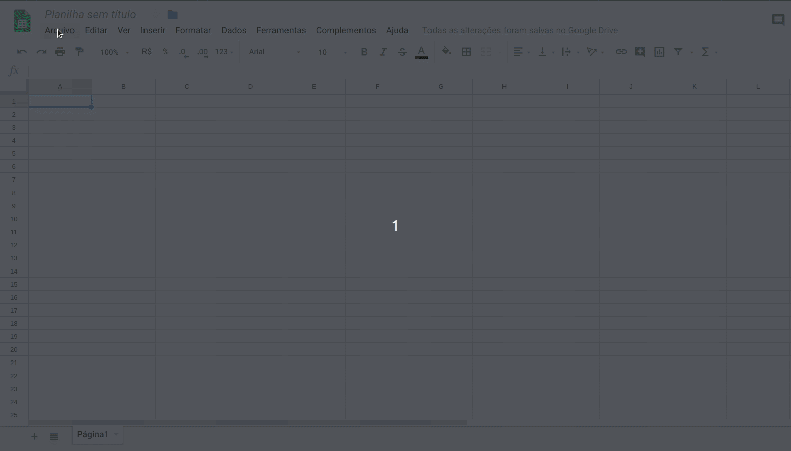
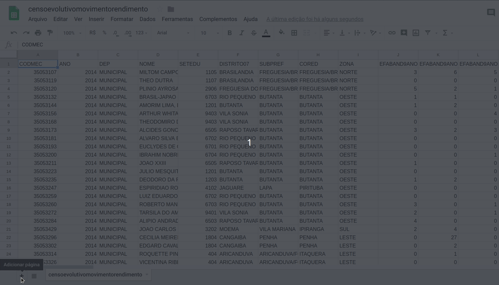
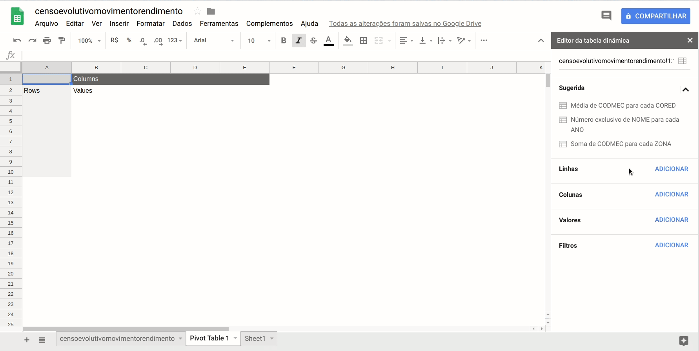
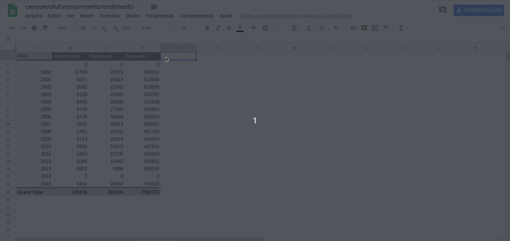
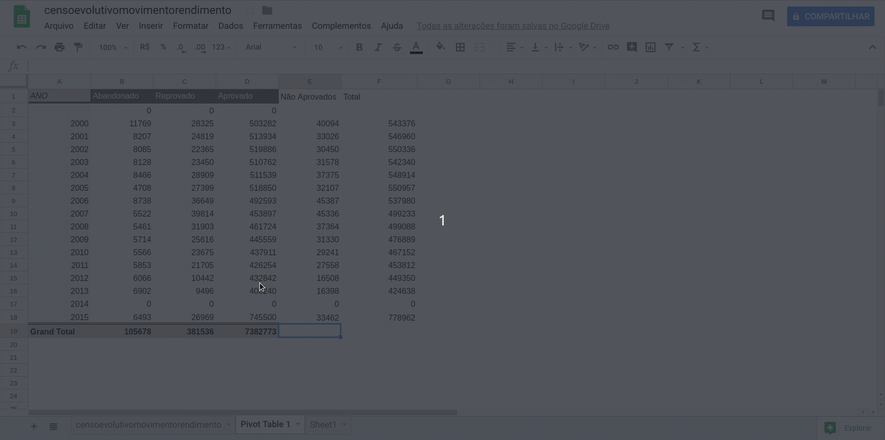
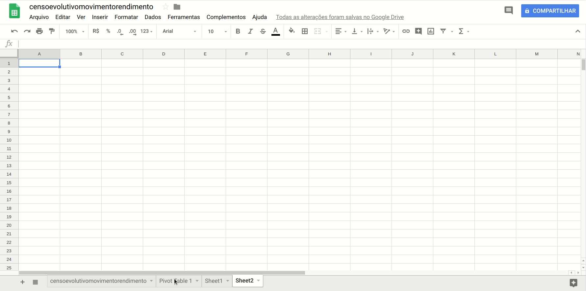

# Tabela Dinâmica

Vamos importar a base de dados [sobre Rendimento e movimento escolar](http://dados.prefeitura.sp.gov.br/dataset/rendimento-e-movimento-escolar-ensino-fundamental).

Começamos abrindo um novo arquivo, selecionando _Arquivo -> Importar_.

Selecionamos Upload e realizamos a transferência do arquivo "censoevolutivomovimentorendimento.csv".

No campo "Tipo de Separador", escolher Personalizado e digitar o símbolo de ponto e vírgula.

Agora, em uma nova planilha, selecionamos _DADOS -> Tabela Dinâmica _

No campo "Quais dados?" selecionamos a planilha "censoevolutivorendimento" em sua totalidade, selecionando o quadrado cinza no canto superior esquerdo das células.

Vamos agora fazer uma análise da evolução das taxas de reprovação e evasão das unidades, ao longo dos anos.

Para isso, vamos criar uma tabela dinâmica com 3 colunas: Ano, número de abandonados, aprovados e reprovados.

Para isso, vamos primeiro selecionar _ANO_ no campo Linhas.

Em seguida, no campo valores, vamos clicar 3 vezes em adicionar e selecionar _TOTALEF_ABAND_, TOTALEF_REPROV e _TOTALEF_APROV_.

Vamos agora criar uma nova coluna, para guardar o valor do total de alunos do ensino fundamental e uma outra para guardar o total de não aprovados(reprovados + abandonos)

Vamos copiar os valores relativos aos aprovados e reprovados em 2015 e criar um gráfico de pizza para representar esses dados.

É importante copiarmos apenas os valores, para isso, colamos usando o comando Ctrl+Shift+V ao invés do usual Ctrl+V.

Vamos criar um gráfico de áreas empilhadas, selecionando os dados relativos ao número de abandonos e reprovações de todos os anos que temos acesso. Vamos excluir o ano de 2014, pois parece haver um erro neste ano, já que todos os valores são zero.

Assim, será possível obter uma visualização do número de não-aprovados(reprovados e abandonados) e a evolução com os anos.

