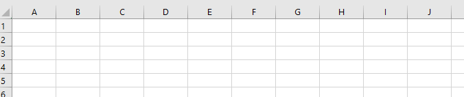
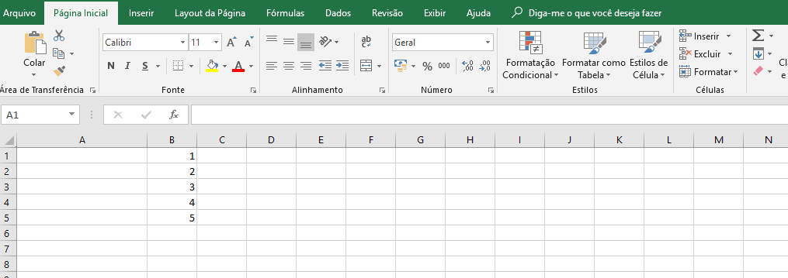
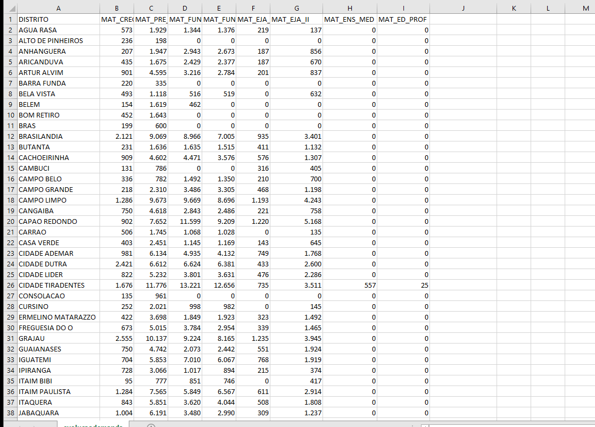
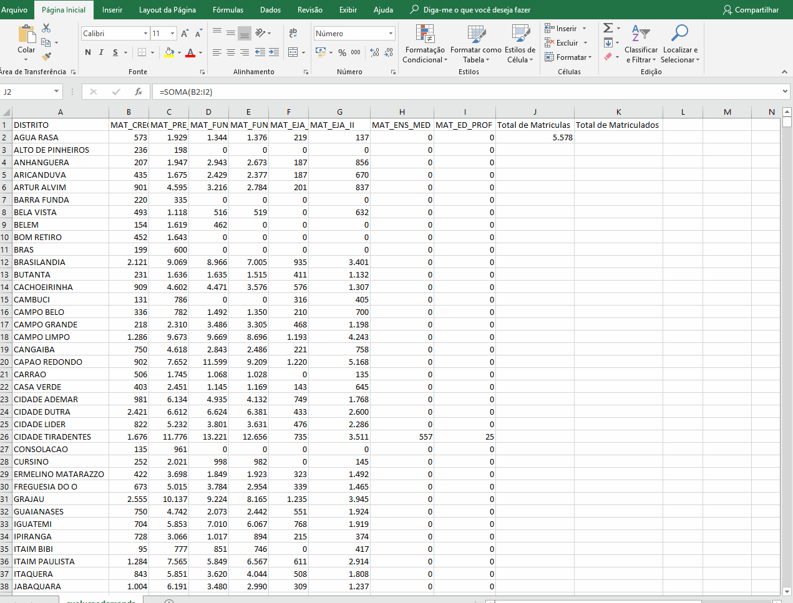
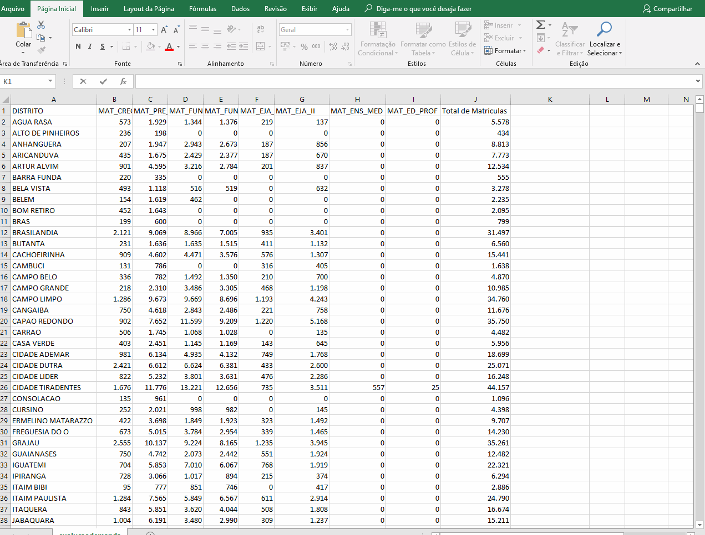

# Fórmulas

Agora que já temos nossos dados importados, vamos começar a extrair informações deles.

Lembre-se que na [pagina](http://dados.prefeitura.sp.gov.br/dataset/perfil-dos-educandos-cor-raca-idade-sexo-necessidades-educacionais-especiais) que fizemos o download do CSV, temos o arquivo "Dicionario" que sera importante para "traduzirmos" as siglas presentes no nosso CSV.

Tópicos a serem abordados:

* Introdução a funções

* Função SOMA

* Funcao CONT.SE

* Função SE

* Função SOMASE

## Introdução a funções

As funções no excel são uma das maneiras mais simples de automatizar os processos, o que e muito útil, desde quando estamos tratando pequenos conjuntos de valores até tabelas bastante grandes.

## Introduzindo valores
Para introduzir um valor no excel, basta clicar na célula em questão e digitar o valor que quisermos. Aqui, usamos o termo valor de forma genérica: Pode ser uma quantia em dinheiro, uma data, um nome. O excel é capaz de tratar todos estes tipos de dados. Vamos ver como informar o que está na célula do excel mais a frente.

## Introduzindo funções
Para introduzir funções, fazemos de maneira similar aos valores: clicamos na célula que queremos alterar e digitamos o que desejamos inserir. Entretanto, para avaliarmos ao excel que queremos que aquilo seja avaliado como uma função ao invés de um valor, basta colocarmos um símbolo de **=** no começo do que estamos digitando.

Uma vantagem de escrever assim, o excel imediatamente reconhece que estamos escrevendo uma fórmula e mostra uma série de opções assim que começamos a escrever o nome da função.

## Barra de Fórmulas

Além de escrever diretamente nas células, umas ferramenta muito prática e a barra de fórmulas. Nela, podemos escrever ou editar o conteúdo das células.

Para isso, basta selecionar a célula que queremos editar, clicando sobre ela e, então, digitar os valores ou fórmulas que desejamos inserir diretamente na barra de fórmulas.

Escrever sobre a célula ou na barra de fórmula são equivalentes, tudo depende da ação que estamos realizando.

## Fórmulas básicas

Podemos fazer operações básicas no excel usando os operadores conhecidos da matemática: +, -, * e /.
No excel nos referenciamos a células pela letra de sua coluna seguida pelo número de sua linha.
Assim, podemos selecionar uma célula para guardar o resultado da operação entre outras células.

1. Para somar, escolha uma célula para guardar o resultado e digite, =C1+C2, por exemplo, e pressione ENTER
2. Para subtrair, escolha uma célula para guardar o resultado e digite, =C1-C2, por exemplo, e pressione ENTER
3. Para multiplicar, escolha uma célula para guardar o resultado e digite, =C1*C2, por exemplo, e pressione ENTER
4. Para dividir, escolha uma célula para guardar o resultado e digite, =C1/C2, por exemplo, e pressione ENTER

## Algumas funções úteis

### Função SOMA
Esta é uma das funções mais básicas e úteis do excel.

Vamos utilizar esta [base de dados](http://dados.prefeitura.sp.gov.br/dataset/demanda-por-vagas-educacao-infantil-e-eja) para calcular o numero de matriculados por distrito. 

* Primeiro, vamos adicionar um cabeçalho, indicando que aquela coluna faz referência ao total de matrículas

* Em seguida, digitamos =SOMA e selecionamos a função SOMA que o excel sugere, com o mouse

* Selecionamos as colunas B até I referentes ao distrito de AGUA RASA

* Agora, na célula J2, temos o total de matrículas em AGUA RASA

E se quisermos repetir esta mesma operação para todos os outros 95 distritos?

### Definindo um nome
Queremos agora aplicar a mesma fórmula de SOMA que utilizamos para ÁGUA RASA para os outros distritos. Poderíamos reescrever em cada um, mas isso não seria muito eficiente. 

Utilizaremos a definição de nomes e a função preencher para facilitar essa tarefa.

Queremos selecionar todas as linhas da coluna J, com exceção da primeira, nosso cabeçalho.

* Selecionamos a célula J2

* Em fórmulas, clicamos em "Definir nome"

* Na nova janela, digitamos o nome "Matrículas"

* em "refere-se a:", incluímos ao final "::$J$97", tendo como resultado final 

	=evolucaodemanda!$J$2:$J$97

Isso indica que estamos associando o nome "matrículas" as células J2 até J97

### Preencher
Agora, vamos aplicar a mesma fórmula SOMA para todos os distritos

* Primeiro, vamos clicar na *CAIXA DE NOME* no canto superior esquerdo e selecionar o nome que acabamos de definir, Matrículas

* Agora, selecionamos o símbolo referente ao comando preencher

* Na caixa que se abriu, selecionamos "para baixo"

Pronto! Nossa fórmula de soma acabou de ser aplicada para todos os distritos!

### Total das Somas
Finalmente, vamos calcular a soma total de todos os matriculados em todos os distritos. Com o nome "matrículas" que definimos anteriormente, isso fica bastante simples:

* Vamos criar um novo cabeçalho chamado "Total geral"

* Selecionamos a célula K2 e inserimos a fórmula de soma

	=SOMA

* Como argumento, digitamos o nome que definimos "matrículas"

* Damos enter, a célula K2 mostra a soma de todas as células da coluna J, com exceção do cabeçalho, conforme definimos pelo nome "matrículas"

### Funcao CONT.SE
Vamos agora começar algumas análises simples dos dados que importamos, utilizando algumas funções do excel

A funcao CONT.SE e bastante útil e pode nos informar o número de células que atendem a algum critério. Vamos supor como exemplo que desejamos contar células contêm a letra "M" e quantas a letra "F" na coluna P. Temos um numero enorme de dados, mas essa analise fica muito simples com a funcao CONT.SE

Primeiramente, vamos criar uma nova planilha, para organizarmos nossas análises. Vamos clicar no botão +, localizado na parte inferior da nossa tela.

Uma nova aba vai se abrir. Podemos clicar duas vezes sobre ela para renomeá-la. Vamos chamá-la de análises.

Agora nessa nova planilha, vamos usar a funcao CONT.SE para verificar a ocorrencia de "F" e "M" P. 

* Selecionamos uma célula e digitar o símbolo de =
* Digitamos CONT.SE. Perceba que o excel começa a mostrar opções conforme você digita, não sendo necessário digitar o comando inteiro.
* Clique duas vezes sobre o nome CONT.SE para inserir a formula na celula.

Conforme aparece na tela, o comando CONT.SE leva dois argumentos:

	=CONT.SE(intervalo; critérios)
	=CONT.SE(Onde você quer procurar?; O que você quer procurar?)
 
Queremos procurar quantas vezes a letra "F" está presente na coluna P da planilha "idadeserieneeracadez17". Então vamos entrar esses dois argumentos na nossa fórmula.

Depois de inserir a CONT.SE na celula, vamos agora selecionar os argumentos.

Primeiro vamos selecionar as células que nos interessam. Neste caso, as informações estão na coluna P. Queremos selecionar a coluna P em sua totalidade. 

* Vamos clicar na planilha "idadeserieneeracadez17" e clicar sobre o "P" que marca o nome da coluna.

Automaticamente, a fórmula que estamos criando, que está escrita na barra de fórmula já foi preenchida com o argumento "idadeserieneeracadez17!P:P" que indica que vamos analisar a coluna P da planilha "idadeserieneeracadez17" em sua totalidade.

Agora precisamos preencher o segundo argumento da função, que nesse caso é o que queremos contar. 

* Clicamos na barra de fórmulas e adicionamos um ponto e vírgula - ;

O ; indica que vamos agora inserir o próximo argumento. Neste caso, queremos contar o número de meninas.

* Inserimos "F", a letra F entre aspas, assim o excel irá contar todas as ocorrências da letra F na coluna P.

* Colocamos então um fecha parênteses - ) - no fim da fórmula e damos enter.

Agora, na nossa planilha "Análises", temos na célula escolhida um valor, 175986, que representa o número de entradas F na coluna P.

Assim, conseguimos obter esse valor de forma muito prática, mesmo o conjunto de dados contendo mais de 300 mil entradas.

Para obter o número de ocorrências da letra "M", a operação é muito similar, basta trocarmos o segundo argumento da CONT.SE de "F" para "M":

Agora temos o total de ocorrências de ambas as letras. Para obter o total de entradas, basta somarmos, escrevendo em uma nova célula =A1+A2

Agora sabemos que o total e 346861, sendo 175986 "F" e 170875 "M". 

### FUNÇÃO SE

A função SE permite que criemos uma condição para que alguma tarefa seja realizada.

Com o COUNT.SE fomos capazes de contar quantas vezes ocorreu um certo valor nos nossos dados, mas e se quisermos, além de ver a ocorrência de grupos femininos e masculinos, saber a quantidade total de alunos de cada sexo, multiplicando pela coluna QTD?

Vamos usar a função **SE**

* Escolha uma célula de destino e digite =SE e clique sobre a função duas vezes

A função SE recebe três argumentos:

	=SE(Teste lógico, valor verdadeiro, valor falso)	
	=SE(Algo for Verdadeiro, faça tal coisa, caso contrário, faça outra coisa)

Entao podemos escrever a funcao como:

	=SE(CELULASEXO = "F", QTD, 0)

Dessa forma, se a célula em questão for igual a F, recuperamos o valor QTD associado a. Se nao, nao contamos ela.

### FUNÇÃO SOMASE

Mas a função SE ainda não é suficiente para descobrirmos o valor total de alunos de cada sexo. Utilizando a função SOMASE, finalmente conseguimos este resultado.

A função SOMASE recebe três argumentos:

	=SOMASE(intervalo, critérios, intervalo_soma)

O argumento intervalo e o intervalo a ser avaliado, segundo o critério no segundo argumento.
O argumento intervalo_soma é opcional: Se o próprio intervalo a ser somado e o mesmo sendo avaliado, deixamos esse argumento em branco. Se não, colocamos o intervalo correspondente a ser somado.

* Escolha uma célula e entre a função =SOMASE clicando duas vezes sobre seu nome

* Escolha a coluna P em sua totalidade. Este é nosso intervalo a ser avaliado.

* Na barra de fórmulas, entre '; "F"', este é o nosso critério de soma

* finalmente, adicione mais um ; e selecione a coluna T, para selecionar as quantidades. Esse é nosso intervalo de soma.

* Adicione um fecha parentes ) e clique enter para visualizar o valor encontrado

* Faremos o mesmo para obter o número de meninos, apenas trocando o "F" por "M"

