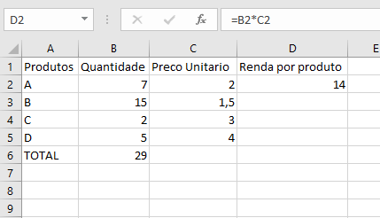
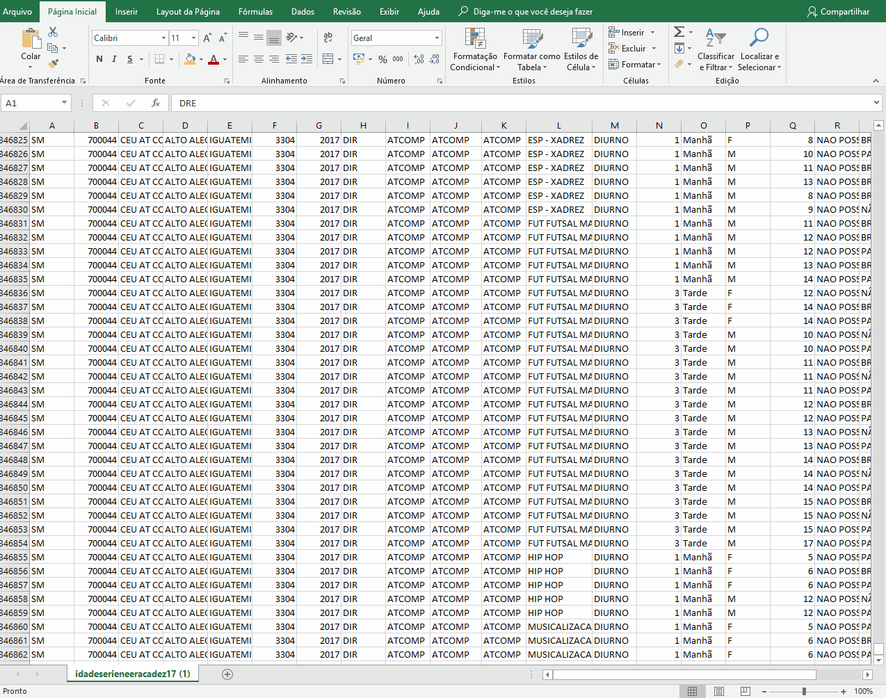
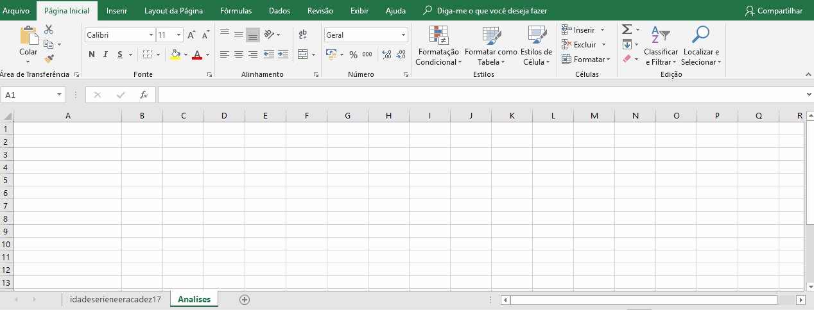
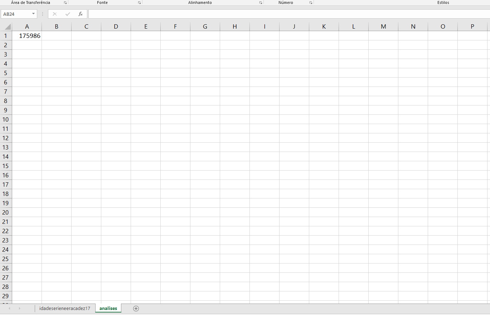
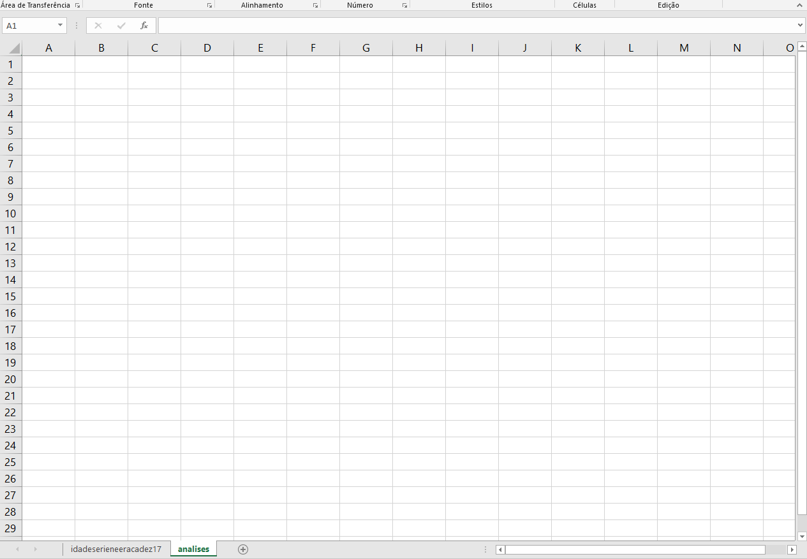

# Formulas

Agora que já temos nossos dados importados, vamos comecar a extrair informacoes deles.

Lembre-se que na [pagina](http://dados.prefeitura.sp.gov.br/dataset/perfil-dos-educandos-cor-raca-idade-sexo-necessidades-educacionais-especiais) que fizemos o download do CSV, temos o arquivo "Dicionario" que sera importante para "traduzirmos" as siglas presentes no nosso CSV.

## Introducao a funcoes

As funcoes no excel são uma das maneiras mais simples de automatizarmos processos, o que e muito útil, desde quando estamos tratando pequenos conjuntos de valores ate tabelas bastante grandes.

## Introduzindo valores
Para introduzir um valor no excel, basta clicar na celula em questão e digitar o valor que quisermos. Aqui, usamos o termo valor de forma generica: Pode ser uma quantia em dinheiro, uma data, um nome. O excel e capaz de tratar todos estes tipos de dados. Vamos ver como informar o questa não celula ao excel mais a frente.

## Introduzindo funcoes
Para introduzir funcoes, fazemos de maneira similar aos valores: clicamos na celula que queremos alterar e digitamos o que desejamos inserir. Entretanto, para avisarmos ao excel que queremos que aquilo seja avaliado como uma funcao ao invés de um valor, basta colocarmos um simbolo de **=** no comeco do que estamos digitando.

Uma vantagem de escrever assim, o excel imediatamente reconhece que estamos escrevendo uma formula e mostra uma serie de opcoes assim que comecamos a escrever o nome da funcao.

## Barra de Formulas

Alem de escrever diretamente nas celulas, umas ferramente muito pratica e a barra de formulas. Nela, podemos escrever ou editar o conteudo das celulas.

Para isso, basta selecionar a celula que queremos editar, clicando sobre ela e, então, digitar os valores ou formulas que desejamos inserir diretamente na barra de formulas.

Escrever sobre a celula ou na barra de formula são equivalentes, tudo depende da acao que estamos realizando.

## Formulas basicas

Podemos fazer operacoes basicas no excel usando os operadores conhecidos da matematica: +, -, * e /.
No excel nos referenciamos a celulas pela letra de sua coluna seguida pelo numero de sua linha.
Assim, podemos selecionar uma celula para guardar o resultado da operacao entre outras celulas.

1. Para somar, escolha uma celula para guardar o resultado e digite, =C1+C2, por exemplo, e pressione ENTER
2. Para subtrair, escolha uma celula para guardar o resultado e digite, =C1-C2, por exemplo, e pressione ENTER
3. Para multiplicar, escolha uma celula para guardar o resultado e digite, =C1*C2, por exemplo, e pressione ENTER
4. Para divir, escolha uma celula para guardar o resultado e digite, =C1/C2, por exemplo, e pressione ENTER

## Algumas funcoes uteis

### Funcao SOMA
Esta e uma das funcoes mais basicas e uteis do excel.

Vamos supor que queremos calcular o total de vendas de uma empresa. Para calcular o total de produtos vendidos,
vamos usar a funcao soma.

* Vamos clicar na celula que queremos guardar o valor da soma.
* Vamos digitar =SOMA e clicar sobre a opcao SOMA.
* Vamos entao clicar sobre a celula contendo o primeiro item a ser somado e, sem soltar, arrastar ate o ultimo item da lista a ser somado.
* Finalmente vamos clicar ENTER e visualizar o valor total da soma

### Combinando funcoes
Vamos supor agora que nossos produtos tem valores distintos, vamos ver a renda total das vendas.
Primeiramente, precisamos multiplicar a coluna com os precos unitarios pelas quantidades

* Selecionamos a celula B2 e multiplicamos pela celula C2

Precisamos fazer os mesmo para as celulas de baixo, mas nao precisamos reescrever a formula!
Basta clicar no canto inferior da celula com a formula que desejamos copiar e arrastar para as celulas de destino. Dessa forma, o excel aplica a mesma formula de maneira automatica.

Podemos fazer o mesmo para copias as formulas de soma que escrevemos anteriormente

### Funcao CONT.SE
Vamos agora comecar algumas analises simples dos dados que importamos, utilizando algumas funcoes do excel

A funcao CONT.SE e bastante útil e pode nos informar o numero de celulas que atendem a algum criterio. Vamos supor como exemplo que desejamos contar quantos alunos são do sexo masculino e quantos são do sexo feminino. Temos um numero enorme de dados, mas essa analise fica muito simples com a funcao CONT.SE

Primeiramente, vamos criar uma nova planilha, para organizarmos nossas analises. Vamos clicar no botão +, localizado na parte inferior da nossa tela.

Uma nova aba vai se abrir. Podemos clicar duas vezes sobre ela para renomea-la. Vamos chama-la de analises.

Agora nessa nova planilha, vamos usar a funcao CONT.SE para verificar a distribuicao de alunos do sexo masculino e feminino.

* Selecionamos uma celula e digitamos o simbolo de =
* Digitamos CONT.SE. Perceba que o excel comeca a mostrar opcoes conforme você digita, não sendo necessário digitar o comando inteiro.
* Clique duas vezes sobre o nome CONT.SE para inserir a formula na celula.

Conforme aparece na tela, o comando CONT.SE leva dois argumentos:

	=CONT.SE(intervalo; criterios)
	=CONT.SE(Onde você quer procurar?; O que você quer procurar?)
 
Queremos procurar quantos alunos do sexo feminino estão presentes na coluna P da planilha "idadeserieneeracadez17". Então vamos entrar esses dois argumentos na nossa formula.

Depois de inserir a CONT.SE na celula, vamos agora selecionar os argumentos.

Primeiro vamos selecionar as celulas que nos interessam. Neste caso, as informacoes sobre o sexo dos estudantes estão na coluna P. Queremos selecionar a coluna P em sua totalidade. 

* Vamos clicar na planilha "idadeserieneeracadez17" e clicar sobre o "P" que marca o nome da coluna.

Automaticamente, a formula que estamos criando, que esta escrita na barra de formula já foi preenchida com o argumento "idadeserieneeracadez17!P:P" que indica que vamos analisar a coluna P da planilha "idadeserieneeracadez17" em sua totalidade.

Agora precisamos preencher o segundo argumento da funcao, que nesse caso e o que queremos contar. 

* Clicamos na barra de formulas e adicionamos um ponto e virgula - ;

O ; indica que vamos agora inserir o próximo argumento. Neste caso, queremos contar o numero de meninas.

* Inserimos "F", a letra F entre aspas, assim o excel ira contar todas as ocorrências da letra F na coluna P.

* Colocamos entao um fecha parenteses - ) - no fim da formula e damos enter.

Agora, na nossa planilha "Analises", temos na celula escolhida um valor, 175986, que representa o numero de entradas F na coluna P.

Assim, conseguimos obter esse valor de forma muito pratica, mesmo o conjunto de dados contendo mais de 300 mil entradas.

Para obter o numero de alunos do sexo masculino, a operacao e muito similar, basta trocarmos o segundo argumento da CONT.SE de "F" para "M":

Agora temos o total de meninas e meninos. Para obter o total de estudante, basta somarmos, escrevendo em uma nova celula =A1+A2

Agora sabemos que o total de estudantes e 346861, sendo 175986 meninas e 170875 meninos. 

Podemos utilizar o CONT.SE para extrair muitas outras informacoes, como total de alunos por periodo, ocorrencia de raca

### FUNCAO SE

A funcao SE permite que criemos uma condicao para que alguma tarefa seja realizada.

Com o COUNT.SE fomos capazes de contar quantas vezes ocorreu um certo valor nos nossos dados, mas e se quisermos, alem de ver a ocorrencia de grupos femininos e masculinos, saber a quantidade total de alunos de cada sexo, multiplicando pela coluna QTD?

Vamos usar a funcao **SE**

* Escolha uma celula de destino e digite =SE e clique sobre a funcao duas vezes

A funcao SE recebe tres argumentos:

	=SE(Teste logico, valor verdadeiro, valor falso)	
	=SE(Algo for Verdadeiro, faça tal coisa, caso contrário, faça outra coisa)

Entao podemos escrever a funcao como:

	=SE(CELULASEXO = "F", QTD, 0)

Dessa forma, se a celula em questao for igual a F, recuperamos o valor QTD associado a. Se nao, nao contamos ela.

### FUNCAO SOMASE

Mas a funcao SE ainda nao e suficiente para descobrirmos o valor total de alunos de cada sexo. Utilizando a funcao SOMASE, finalmente conseguiremos este resultado.

A funcao SOMASE recebe tres argumentos:

	=SOMASE(intervalo, criterios, intervalo_soma)

O argumento intervalo e o intervalo a ser avaliado, segundo o criterio no segundo argumento.
O argumento intervalo_soma e opcional: Se o proprio intervalo a ser somado e o mesmo sendo avaliado, deixamos esse argumento em branco. Se nao, colocamos o intervalo correspondente a ser somado.

* Escolha uma celula e entre a funcao =SOMASE clicando duas vezes sobre seu nome

* Escolha a coluna P em sua totalidade. Este e nosso intervalo a ser avaliado.

* Na barra de formulas, entre '; "F"', este e o nosso criterio de soma

* finalmente, adicione mais um ; e selecione a coluna T, para selecionar as quantidades. Esse e nosso intervalo de soma.

* Adicione um fecha parentes ) e clique enter para visualizar o valor encontrado

* Faremos o mesmo para obter o numero de meninos, apenas trocando o "F" por "M"

