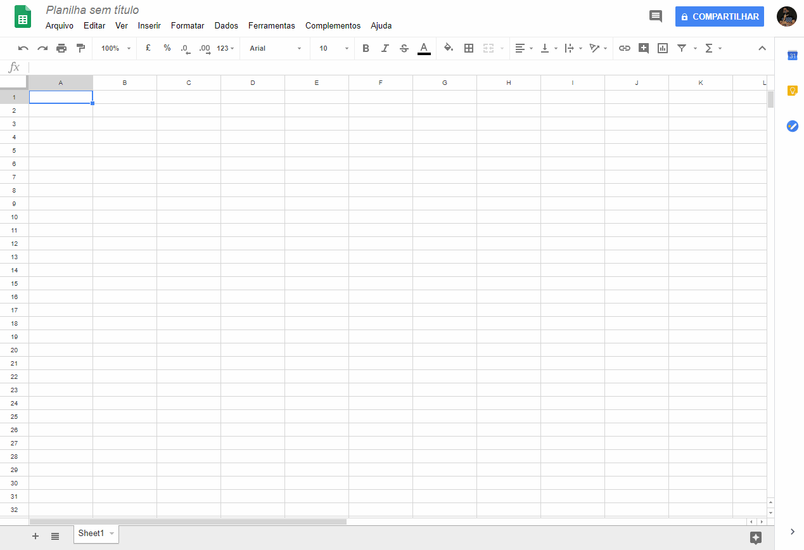
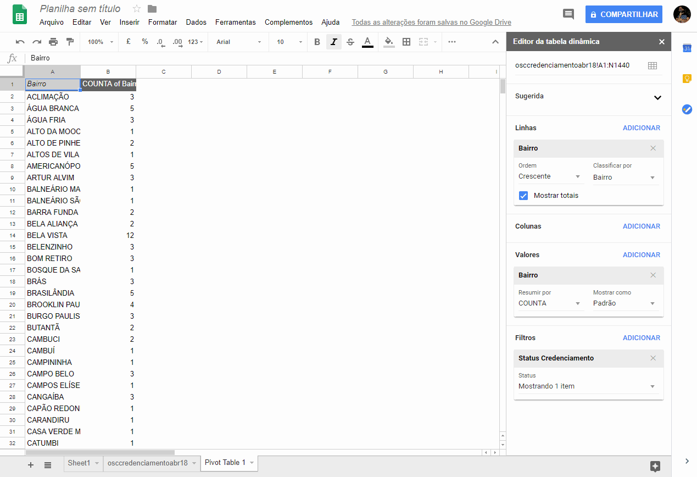
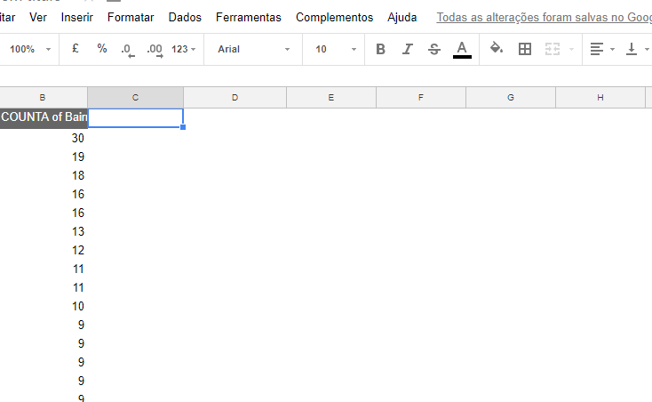

# Alternativas ao Excel

## Google Sheets

O Google Sheets e uma ferramente muito poderosa e, o melhor de tudo, gratis!

Ela pode ser acessada pelo navegador, editada por multiplos usuarios e os seus arquivos ficam salvos na nuvem e podem ser acessados por qualquer computador, atraves da sua conta do google.

### Acessando o Google Sheets

* Acesse [o site do google sheets](https://www.google.com/sheets/about/), logue com sua conta do google.

* Crie uma nova planilha em branco

### Importando nosso .csv

* Faca o download do arquivo ["Instituições Credenciadas - Abr/2018"](http://dados.prefeitura.sp.gov.br/dataset/organizacoes-credenciadas-para-atendimento-da-educacao-infantil)

* Clique em Arquivo > Importar > Upload 

* Arraste o arquivo osccredenciamentoabr18.csv da pasta de downloads para a janela do Google sheets

* Aguarda a realizacao do upload

* Selecione **Inserir novas paginas**

* Selecione **Personalizado** e insira um ponto e virgula ; na caixa

* Clique em **Importar dados**

* Aguarde a finalizacao da importacao e clique em **"Abrir agora"**, caso sua planilha nao apareca automaticamente.

### Usando funcoes no Google Sheets

Agora que temos nossos dados importados no Google Sheets, podemos comecar a operar sobre eles.

Vamos analisar quais sao os bairros com organizacoes credenciadas e quantas elas sao.

#### Criando uma tabela dinamica no Google Sheets

* Na aba superior, clique em Dados > Tabela Dinamica

* No Menu da direita, na secao "Linhas", clique em ADICIONAR e no menu, escolha Bairro

* Na secao "Valores", clique em ADICIONAR e selecione Bairro

* Na secao "FILTROS", clique em ADICIONAR, selecione "Status Credenciamento"

* Clique em "Mostrando todos os itens" e descelecione "DESCREDENCIADA" e clique em OK

* De volta na secao "Linhas", em Ordem, selecione Decrescente

* Em classifica por, selecione COUNTA de Bairro

* Feche o menu da direita, clicando no "X"

O que obtivemos e uma nova tabela, em que os bairros aparecem em ordem alfabetica e, ao lado, temos quantas organizacoes credenciadas estao presentes em cada um deles.

### Criando um grafico a partir dos dados

Vamos criar um grafico, mostrando quais bairros tem, pelo menos, 10 organizacoes ou mais cadastradas.

* Clique sobre a celula 1A e, sem soltar o clique, arraste ate a celula B11, contendo o 10 referente a ITAQUERA

* Clique em Inserir > Grafico

* Em "Tipo de grafico", selecione Grafico de colunas

* Clique na caixa "Alternar linhas/colunas"

* Assim, obtivemos um grafico com os bairros que tem mais de 10 organizacoes cadastradas e os suas quantidaes correspondentes

### Verificando distribuicao de organizacoes por bairros

E se quisessemos saber quantos bairros tem 1 instituicao cadastrada, quantos tem 2 e assim por diante?

Primeiro vamos calcular as frquencias:

* Vamos criar uma coluna "Quantidade de organizacoes"

* Vamos preencher suas linhas com valores de 1 ate 6

* Na linha de numero 8 vamos escrever 7 ou mais

Repare que o texto "7 ou mais" ficou alinhado a esquerda, vamos arrumar isso:

* Clique sobre a celula **C8**

* Clique na opcao Formatar > Alinhar > Direita

Pronto, agora todos os valores estao alinhados!

Agora vamos criar a coluna "Quantidade de bairros", na coluna D. Nessa coluna, vamos colocar quantos bairros tem exatamente a quantidade de organizacoes listadas na esquerda. Para isso, iremos usar a funcao **FREQUENCIA**.

#### FREQUENCIA

A funcao frequencia recebe dois argumentos, um vetor com dados e os intervalos que iremos separar esses dados.

	=FREQÜÊNCIA(matriz_dados; matriz_bin)
	=FREQÜÊNCIA(dados; intervalos)

Nos ja temos esses dois argumentos! A matriz_dados e nossa coluna B e os intervalos sao nossa coluna C, que criamos anteriormente!

* Clique sobre a celula D2 e digite =Frequency e selecione a funcao frequency

* Selecione a coluna B em sua totalidade, clicando sobre o B. Esse e nosso vetor de dados

* Digite um ponto e virgula, indicando fim do primeiro argumento

* Selecione agora os numeros de 1 a 6 na Coluna C. Esses sao os nossos intervalos.

* Nao selecionamos o 7 ou mais. Automaticamente, a funcao frequencia vai colocar os valores acima do nosso intervalo na celula seguinte.

### Plotando um novo grafico

Vamos agora criar um novo grafico, a partir das novas informacoes que coletamos.

* Selecione as celulas de D2 ate D8 (D2:D8)

* Clique em Inserir > Grafico

* Selecione "Grafico de "

* Clique em marcador e escolha as celulas C2 ate C8 (C2:C8)

Pronto! Agora temos um grafico que mostra a distribuicao do numero de organizacoes cadastradas por bairro: Quantos bairros tem 1 organizacao cadastrada, quantos tem 2 e assim por diante.

