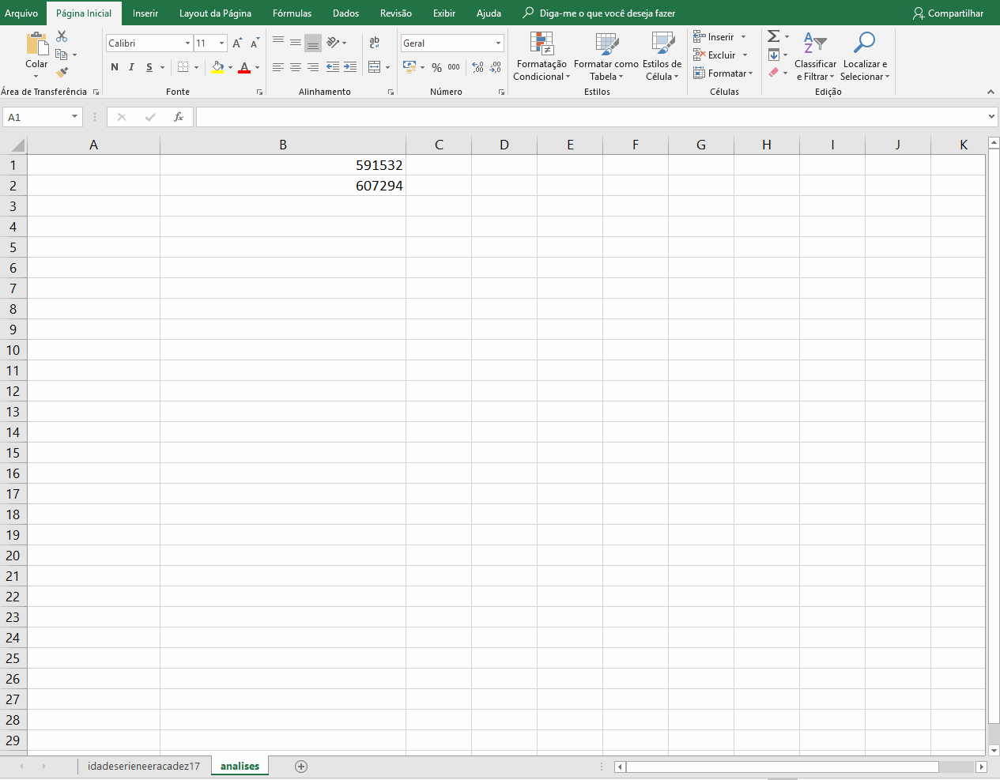
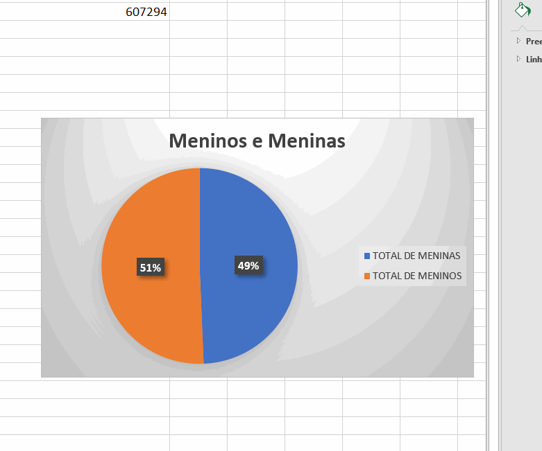

# GRAFICOS

Graficos sao ferramentas muito poderosas. Com eles somos capazes de visualizar mais facilmente mesmo conjuntos de dados mais complexos.

## Criando um grafico de pizza simples

Utilizando os dados que coletamos no tutorial anterior, numero total de meninos e meninas, vamos criar a partir deles um grafico de setores simples.

Inserir graficos no excel pode ser bastante simples

* Se voce ainda nao o fez, crie duas celulas com os nomes "TOTAL DE MENINAS" e "TOTAL DE MENINOS", ao lado dos valores correspondetes

* Selecione as 4 celulas, clicando sobre uma delas e arrastando ate as outras

* Na parte superior da tela, selecione a opcao "Inserir"

* Selecione "Inserir grafico de pizza ou rosca"

O excel ira gerar automaticamente o grafico referente para voce

## Customizando o grafico

Vamos ver agora como mudar a aparencia do nosso grafico

Primeiro vamos mudar o titulo do grafico

* Clique no grafico e em seguida clique duas vezes sobre o titulo do grafico para altera-lo

Podemos tambem alterar o visual geral do grafico

* clique duas vezessobre o grafico e escolha uma das opcoes apresentadas

Finalmente, podemos escolher as cores que serao utilizadas em nossos setores

* Clique com o botao direito sobre um setor, selecione a opcao preenchimento e escolha a opcao desejada

