# Relatório Final - MAC213
# Projeto : Desenvolvimento de tutoriais de manuseio e análise de dados
# Guilherme Yambanis Thomaz - 8041265

## Objetivos

Instituı́da pela Portaria n o 3.786, de 17 de abril de 2017, da Secretaria Municipal de
Educação (SME), a Polı́tica de Governo Aberto “Pátio Digital” tem como objetivo aproxi-
mar diferentes setores da sociedade para promover ações de abertura de dados, metodologias
colaborativas e inovação tecnológica na gestão da Rede Municipal de Educação e na entrega
de serviços educacionais à população.
O Pátio Digital está estruturado em três eixos:
1. “Transparência e Dados Abertos”, com o fortalecimento da disponibilização de dados
públicos e informações sobre as polı́ticas educacionais;
2. “Inovação Tecnológica”, com a construção colaborativa de ferramentas e serviços di-
gitais à comunidade escolar, no formato de código aberto;
3. “Colaboração Governo-Sociedade”, que são espaços e metodologias de interação entre
o setor público, Academia, sociedade civil e iniciativa privada.
Dentro deste último eixo, “Colaboração Governo-Sociedade”, se insere o Programa de
Cooperação em Pesquisa, que tem como objetivo conectar a Secretaria Municipal de Educação
com o campo acadêmico, estabelecendo mecanismos para o desenvolvimento de projetos e
ações que estimulem a produção de conhecimento sobre as polı́ticas educacionais do mu-
nicı́pio.
É no âmbito do Programa de Cooperação em Pesquisa que se estabelece a colaboração
entre SME, via Pátio Digital, e Tecs, grupo de extensão universitária do Instituto de Ma-
temática e Estatı́stica da USP (IME-USP). A partir do diálogo entre as equipes do Pátio
Digital e do Tecs, foram levantados quatro projetos que articulam os conhecimentos da
Ciência da Computação e os desafios de polı́ticas públicas educacionais do municı́pio.

Com o intuito de fortalecer a transparência, a SME tem publicado e atualizado um conjunto de bases de dados referentes à educação municipal, variando de planilhas a microdados. O acesso a tais bases de dados pode ser, muitas vezes, limitado, devido à falta de conhecimento para manuseio das bases do público interessado (jornalistas, pesquisadores, integrantes de conselhos escolares). Frente a esse desafio, o Pátio Digital lançou o “ABC Dados”, que consiste na publicação de tutoriais que visam a orientar, numa linguagem didática e fluida, metodologias de manuseio das bases.

Ao aderir ao Projeto 4, o aluno deverá desenvolver tutoriais para integrar o “ABC
Dados”. Os tutoriais devem variar de complexidade e de software (por exemplo, um tutorial
voltado para manuseio no excel e outro, referente a uma base de maior complexidade, no
software estatı́stico R Studio).

## Tarefas

Após reunião realizada no dia 31 de agosto com Priscilla, na sede do Pátio Digital, definiu-se que os temas dos tutoriais seriam Excel e Python, e que o controle de horas seria feito através da ferramenta Toggl.

Os dez tutoriais a serem realizados ficaram igualmente divididos entre Excel e Python.
Um histórico detalhado das atividades necessárias para cada tutorial segue ao final deste documento. 

Os cinco tutoriais de cada plataforma foram estruturados da seguinte forma:

### [Tutoriais Excel](https://github.com/yambanis/MAC213/tree/master/Excel)

Tutoriais acessíveis, sobre o Excel, para manipulação de dados, em especial arquivos csv.

#### Tutorial 1

* O que é uma planilha? 

* Morfologia básica

* Importando conjunto de dados

#### Tutorial 2

* Introdução a funções

* Função SOMA

* Função CONT.SE

* Função SE

* Função SOMASE

#### Tutorial 3

* Criando um gráfico de pizza simples

* Customizando o gráfico

#### Tutorial 4

* Google Sheets

* Importando csv

* Usando funções no Google Sheets

* Criando uma tabela dinâmica no Google Sheets

* Criando um gráfico a partir dos dados

* Função FREQUÊNCIA

#### Tutorial 5

* Criando uma tabela Dinâmica

* Manipulação e visualização dos dados

### [Tutoriais Python](https://github.com/yambanis/MAC213/tree/master/Python)

Tutoriais criado na plataforma Jupyter Notebook.

Tópicos abordados:

#### Tutorial 1

* Noções elementares de Python

#### Tutorial 2

* Pacote Pandas

#### Tutorial 3 e 4

* Criando gráficos com Matplotlib

#### Tutorial 4

* Regex

#### Tutorial 5

* Definindo funções

> Os temas foram pré-definidos junto de minha supervisora, mas foram alterados organicamente, à medida que eram necessárias novas ferramentas para as análises que se mostraram interessantes. Dessa forma, foi o conteúdo dos tutoriais e suas análises que ditaram as operações e ferramentas e sua ordem de apresentação, e não o contrário. Dessa forma, o tutorial se desenrola de maneira mais orgânica com o leitor.

## Progresso e desafios

### Excel

Ficou definido inicialmente que os tutoriais seriam escritos em Markdown, por ser um formato de fácil exportação, seja para plataforma web, seja para pdf, além da possibilidade de inserção de links e gifs.

A construção e definição dos tutoriais tomou um certo tempo, porém, o maior desafio se mostrou na criação dos gifs, que demandaram diversas tentativas com ferramentas diferentes.

Além disso, após a parte técnica finalizada, escrever o texto de forma enxuta e didática também se mostrou algo desafiador. Grande parte da carga horária foi dedicada para refacção e reescrita, a fim de maior clareza e melhor didática.

Como o Excel depende da interação com a interface gráfica, foi necessário que o texto fosse bastante descritivo. Os gifs ajudaram muito nesse sentido, comunicando ações mais fáceis de serem traduzidas de maneira visual.

### Python

Já para os tutoriais em Python, preferi o formato Notebook. 

Iniciei os tutoriais usando a plataforma do Google, o Colab. Entretanto, após algum tempo, encontrei diversas dificuldades, como importações incompletas entre outras.

Isso tornou necessário migrar o projeto para o formato Jupyter Notebook. Como ele também é renderizado no próprio Github, não se mostrou uma perda muito grande nesse aspecto, além do ganho em robustez pela execução local do código.

A criação dos tutoriais em Python se mostrou mais desafiadora do ponto de vista técnico, exigindo muitas refacções e pesquisa sobre a linguagem.

Certas tarefas que propus nos tutoriais se mostraram mais complexas do que o previsto, mas isso permitiu não só que eu aprimorasse meus conhecimentos de Python, como também que eu criasse os tutoriais de um ponto de vista mais empático com o leitor, o que, acredito, melhorou a didática.

A junção do código com o texto em um só lugar, graças ao Jupyter Notebook, permitiu a criação de um tutorial muito mais intuitivo, já que o código e sua explicação estão lado a lado e o aluno pode executá-lo em tempo real.

## Pôster

O Pôster foi fixado no IME no dia 8 de novembro. Criei ele usando a ferramenta CorelDraw. Busquei inspiração em com _jeito_ matemático, com uma linha que dá uma ideia de continuidade, início e ponto de chegada, fazendo umas referência ao conhecimento adquirido junto aos tutoriais.

Observei uma tendência geral do IME em Pôster muito pouco atrativos, com enormes blocos de texto, que geram pouco para despertar a curiosidade dos transeuntes. Assim, fiz algo visualmente diferente, porém sóbrio, já que o objetivo era despertar a curiosidade e interesse de outros alunos na matéria.

## Resultado

O resultado final foram 10 tutoriais que servem para apresentar as duas plataformas, Python e Excel, de maneira amigável.

O intuito foi partir de um ponto inicial bastante básico, para que, independente do nível de conhecimento do leitor, fosse possível a utilização das ferramentas, sem uma barreira de entrada alta e intimidadora.

Os tutoriais iniciais são muito detalhados, sem pressupor nenhum conhecimento prévio.

Após os tutoriais iniciais de cada assunto, temas mais complexos começam a ser abordados de forma mais prática, o que foi possível graças à introdução aos _features_ anteriormente.

É esperado que quem acompanhe todos os tutoriais seja capaz de sair de um total desconhecimento das ferramentas e possa criar análises de dados pertinentes com as técnicas adquiridas ou, ainda, possa utilizar esses tutoriais como ponto de partida para buscar informações mais específicas, já com certa familiaridade em relação às plataformas.

# Entrega

Não existiu uma data para entrega final, visto que os tutoriais foram sempre atualizados no Github e ficaram disponíveis conforme eram realizados.
Entretanto, existiu uma entrega oficial, antes do final do projeto.

O projeto cumpriu com as expectativas estabelecidas junto à prefeitura no início do semestre, tanto em forma, quantidade, abordagem e prazos. Foram recebidos com muito entusiasmo pela supervisora responsável e espera-se que, em breve, sejam incorporados ao ABC Dados.

# Conclusão

Acredito que a atividade como um todo da matéria foi muito gratificante e alcançou resultados muito positivos.

Os tutoriais entregues serão muito útil para disseminar a possibilidade de acesso às bases de dados da SME, sendo ela utilizada de forma mais contundente para avaliar mazelas a serem melhoradas na educação pública, através da análise dos dados.

Pessoalmente, foi uma oportunidade muito boa, tanto para aprimoramento de hard skills, com Excel e Python, bem como melhorar a apresentação textual, já que a acessibilidade dos textos dos tutoriais foi um dos pontos focais da atividade.

Além disso, interessante notar que, os próprios tutoriais geraram algumas análises interessantes, mesmo que este não fosse o foco principal deles.

Posso dar destaque para as taxas de aprovação e evasão do ensino fundamental, dados que realmente se mostraram inesperados e, acredito, podem fomentar a curiosidade do potencial leitor, bem como ocorreu comigo.

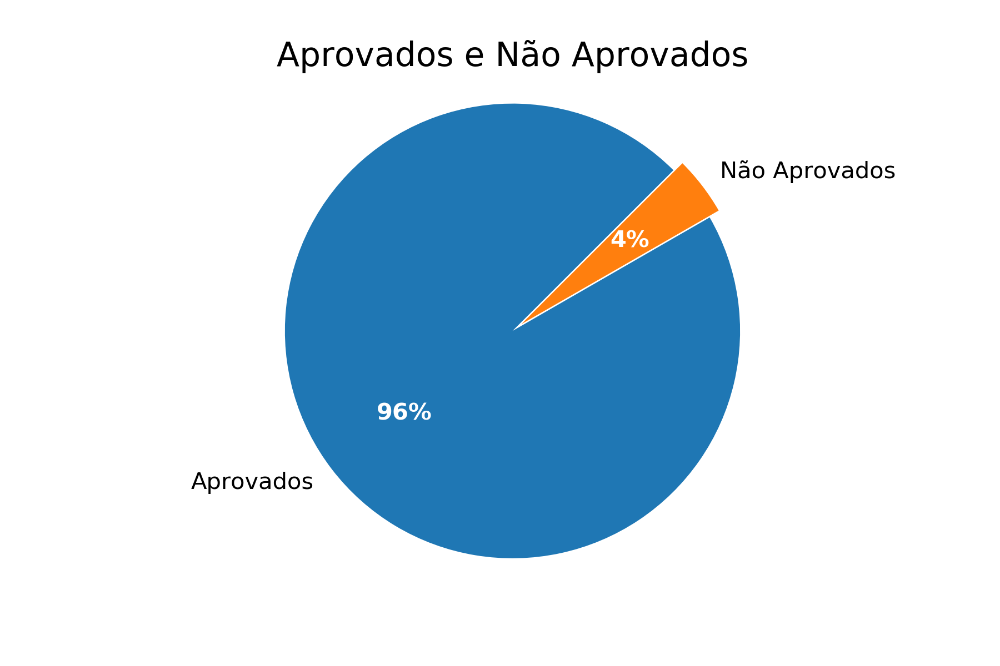

A supervisora, Priscilla, foi presente durante o projeto, dando feedbacks pertinentes e sendo de fácil comunicação.

De modo geral, acredito que a parceria que foi estabelecida neste semestre entre a prefeitura e os alunos do IME pode ser muito interessante, para o desenvolvimento da sociedade, para aventurar os alunos para além do campus, desenvolvendo o lado técnico junto com uma visão holística da sociedade e promovendo um interesse na atividade em comunidade.

Acho também de extrema necessidade salientar o trabalho realizado pelos alunos do TECs, que nos acompanharam durante o semestre, esclarecendo dúvidas sobre a matéria e que foram os responsáveis por estabelecer a parceria do meu projeto. O projeto foi muito interessante, bem estruturado, a pessoa que foi minha supervisora esteve engajada no projeto, o que fomentou uma enorme possibilidade para o êxito obtido.

## Acompanhamento

O acompanhamento se deu de duas formas principais:

* [Repositorio](https://github.com/yambanis/MAC213) aberto no Github, onde todas os arquivos foram salvos durante o semestre

* Controle de horas realizado através da ferramenta Toggl

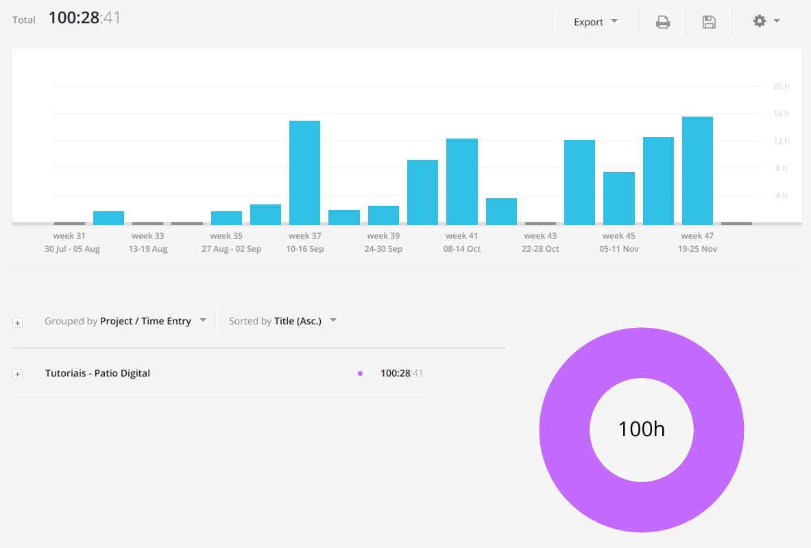

### Horas despendidas no projeto

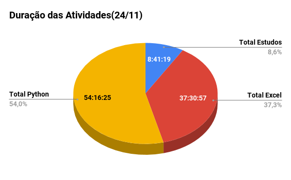

### Horas despendidas (detalhado)

# Tarefas Realizadas (detalhado)

Irei detalhar as tarefas realizadas, utilizando as horas logadas na ferramenta Toggl.
Algumas imagens meramente ilustrativas foram adicionadas, os tutoriais integrais podem ser visualizados no repositório, já que seria inviável colocá-los em pdf, principalmente pela impossibilidade da apresentação dos GIFs em PDF.

Dessa forma, cada entrada no Toggl tem um nome que defini na hora como um resumo aproximado da atividade que estava realizando no momento e, ao seu lado, a duração que a ferramenta gravou.

Estes dados são passíveis de conferência, tanto com a tabela que a ferramenta gerou e o gráfico que criei para ilustrar a divisão das horas gastas, bem como com os commits gerados no Github ao longo do Semestre.

Os fatos aqui seguem em ordem cronológica com algumas exceções, que foram agrupadas por projeto, para facilitar o entendimento do processo de criação.

## Criação do Github, estudos iniciais	1:56:00
> Após a troca inicial de emails com Priscilla, criei o repositório que armazenou o projeto durante todo o semestre. Priscilla me passou algumas referências de tutoriais, que estudei e iniciei algumas pesquisas sobre tópicos a serem abordados, bem como familiarizei-me com o banco de dados da SME.

## Reunião Patio Digital	2:00:00
> Reunião inicial no pátio Digital, em sua sede no Pacaembu. Nela, ficou definido o assunto dos tutoriais, que seria Excel e Python. Os demais acompanhamentos e feedbacks se deram por meio eletrônico, seja por e-mail ou Telegram

## Pesquisas iniciais - Tópicos Excel	1:32:00
> Pesquisei forma e conteúdo de cursos e tutoriais de Excel. 

## Pesquisando Referências - Tutoriais	1:29:00
> Continuação da pesquisa anterior, após ambas as pesquisas, consegui definir o formato dos tutoriais, com o uso de GIFs. Grande parte da decisão foi devida a tutoriais já existentes no site do Pátio Digital. Além disso, pesquisei cursos, tanto em formato de vídeo como escritos. Foi cogitada a realização dos tutoriais em vídeo mas, como inicialmente existia a possibilidade de eles serem utilizados como apoio para aulas presenciais, o formato texto foi escolhido.

## Pesquisando Tópicos	1:44:19
> Elenquei quais seriam os tópicos mais interessantes para serem abordados. Fiz um RoadMap, dos tópicos a serem abordados nos 5 tutoriais. O RoadMap sofreu diversas alterações ao longo do semestre, seja por auto crítica ou por feedback da supervisora. Também foi definido junto da supervisora que, ao máximo possível, os tutoriais usaria exemplos diretos das bases de dados da SME.

## inicio tutorial 1	1:55:35
> Dei início ao tutorial 1

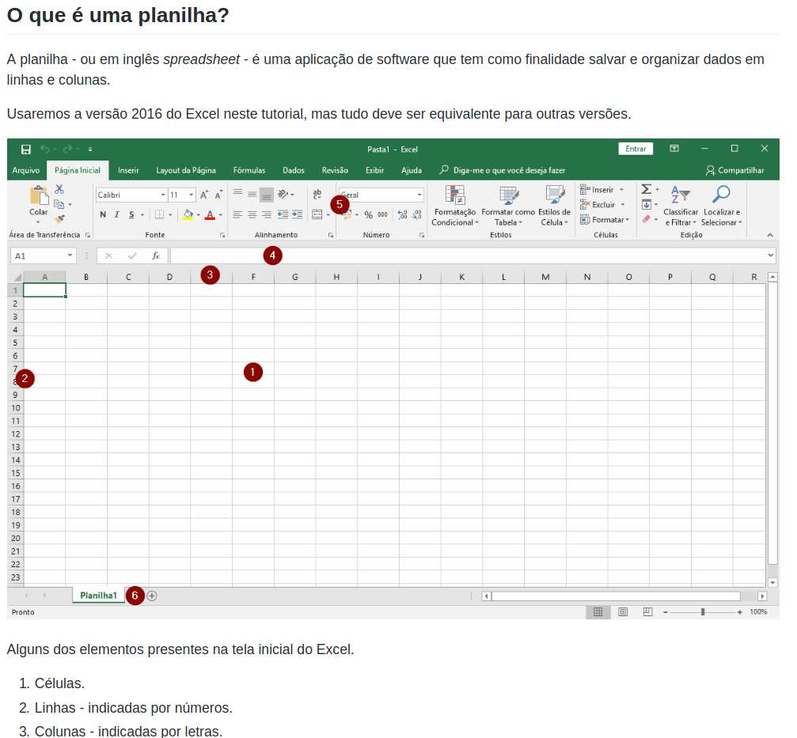

## Tutorial Excel	1:59:37
> Continuação do Tutorial 1 e início do segundo tutorial

## Tutorial funções	0:15:58
> Dei início ao segundo tutorial

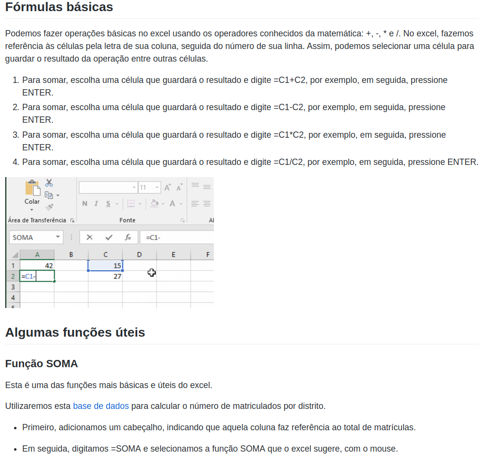

## Tutorial de fórmulas	2:16:33
> Continuação do item anterior 

## tutorial GSheets	0:58:46
> Decidi criar um tutorial sobre o Google Sheets, por ser um software livre e online

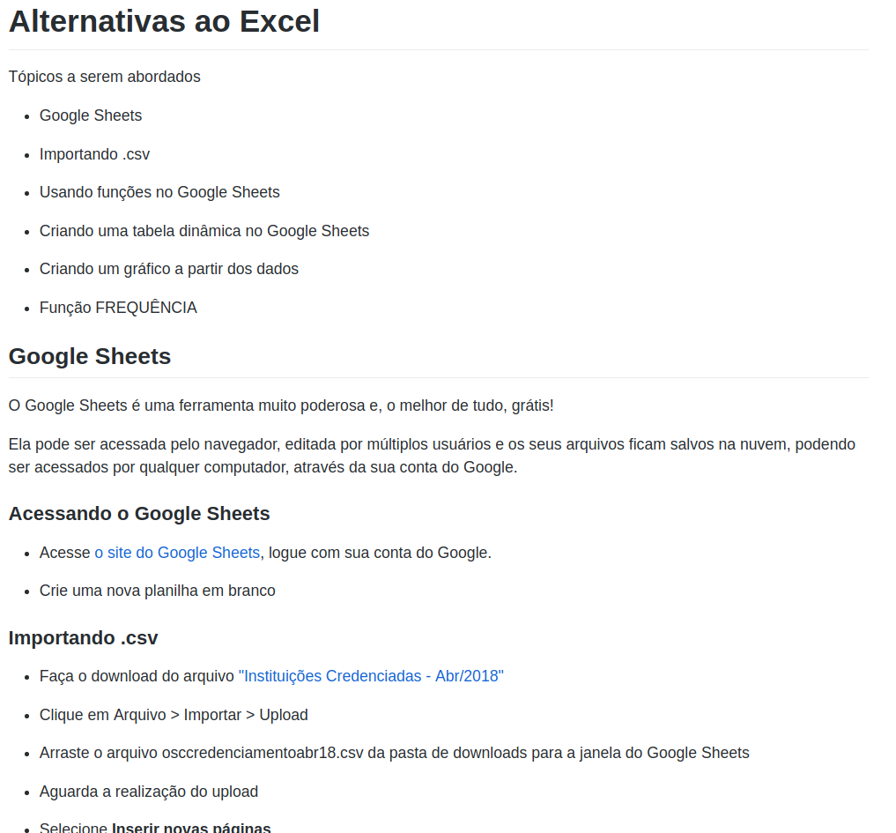

## revisões	1:49:26
> A quantidade de texto dos tutoriais requereu diversas revisões, tanto gramática e ortografia, como forma e clareza. Por se tratarem de tutoriais pressupondo nível de conhecimento bastante básico, era extremamente necessária clareza nos comandos e explicações. Existiram Diversas revisões necessárias, seja por auto crítica ou por feedbacks fornecidas pela supervisora. Era imprescindível que não houvessem erros nos tutoriais para que os mesmo possam ser publicados.

## Revisões	0:53:27
> Vide revisões

## correção orto	1:31:50
> Vide revisões

## checagem	0:29:59
> Mudanças na função SOMA para ser relevante com a base de dados da SME, baseado em Feedback da supervisora

## Refatorando	0:58:34
> Organização das pastas do Github, modularizando os tutoriais e mudança dos links dos GIFS

## Refatorando	1:13:58
> Vide acima

## revisões	0:57:23
> Vide revisões

## arrumando gifs e tutorial funções	1:56:08
> Os gifs dos tutoriais do Google Sheets continham informações pessoais em alguns frames. Tiveram que ser refeitos em sua totalidade

## Conformando gifs	6:00:28
> O programa que utilizei para gravar os gifs gerou problemas de compressão. Os gifs tiveram que ser refeitos para manter maior fidelidade.

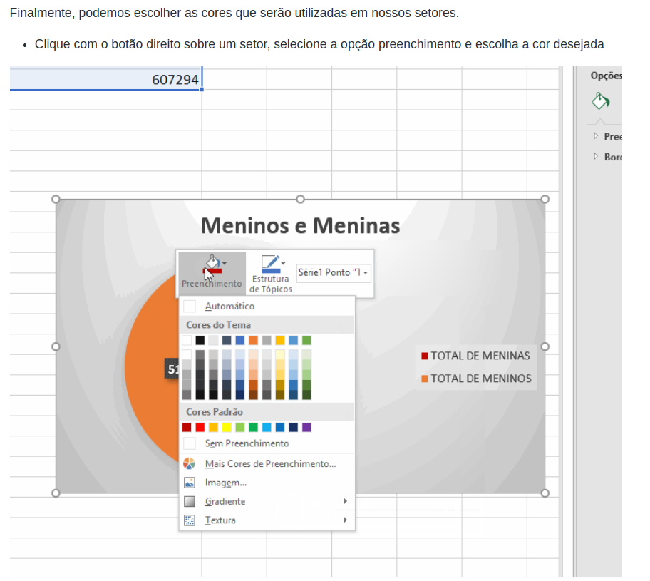

## correções ortográficas e revisões	4:53:55
> Vide revisões

## Revisão CountSe Excel	2:15:55
> Função COUNTSE estava conceitualmente confusa, atrapalhando aprendizado.

## gráfico de barras excel	1:17:40
> Continuação e melhoria do tutorial sobre gráficos

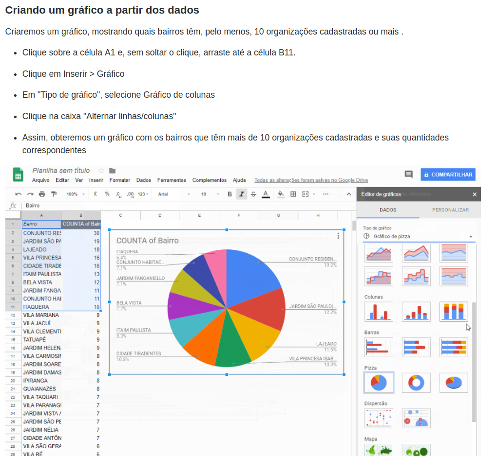

## Tutorial Tabela Dinâmica	0:53:04
> Tutorial sobre Tabela Dinâmica

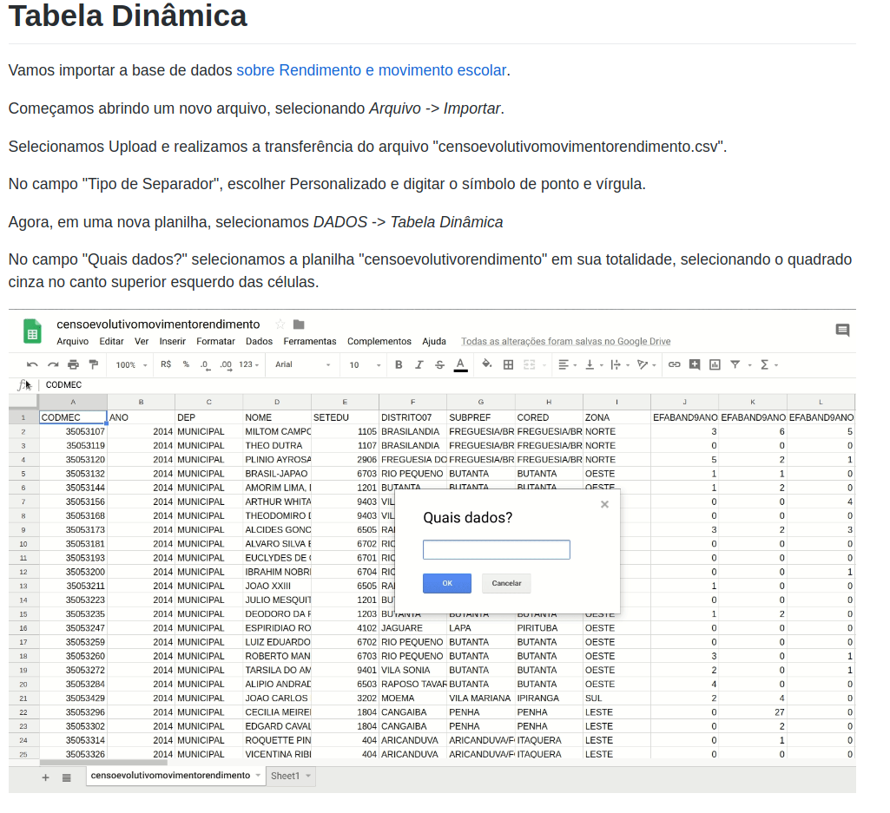

## Continuação tutorial Tabela Dinâmica	2:10:41
> Vide acima

## Correções Finais	2:42:00
> Últimas correções e checagens para entrega dos tutoriais finalizados

## planejamento Python	0:55:28
> Elenquei quais informações seriam as mais interessantes para os tutoriais. Decidi que os tutoriais seriam feitos na plataforma Google Colab e que abrange conceitos básicos, Pandas e MatPlotLib

Aqui, um exemplo de código que estava inicialmente no Google Colab, mas teve que ser posteriormente refeito.

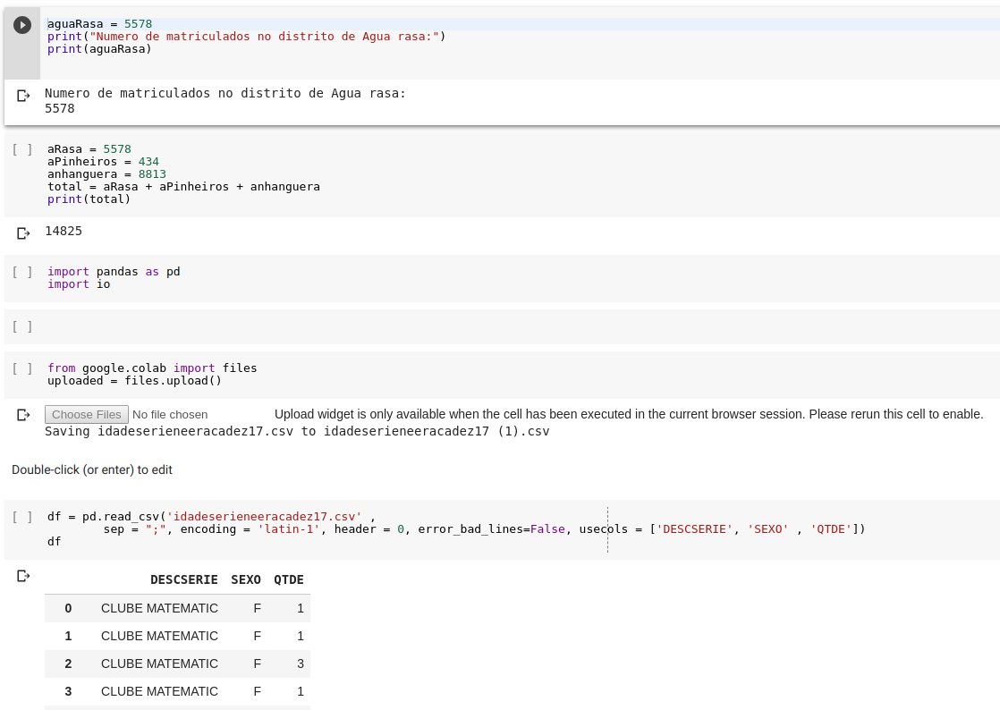

## início tutorial Python	2:24:33
> Dei início ao tutorial de Python, que cobre conceitos básicos da linguagem de programação. Neste estágio o projeto estava sendo feito no Google Colab e em um arquivo Notebook único.
Foram cobertos conceitos como variáveis, operações básicas, tudo que julguei necessário para um primeiro contato e desmistificar a linguagem de programação como um todo. Essa parte não era estritamente necessária para a realização da análise de dados, mas acredito que seja fundamental, para 'nivelar' o leitor que está iniciando o tutorial.

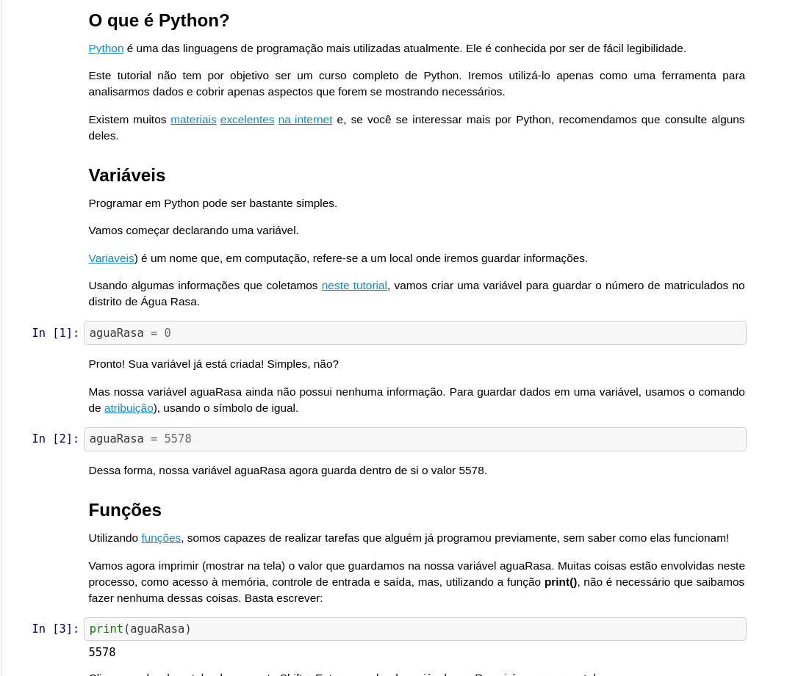

## Continuação tutorial Pandas	2:08:04
> Início do tutorial de Pandas. O Pandas pareceu uma escolha natural para um tutorial sobre análise de dados, pelo seu poder e popularidade. Não era uma biblioteca na qual eu tinha fluência e isso se mostrou um desafio, já que tinha que adquirir o conhecimento necessário à medida que os tutoriais iam exigindo. Foi muito gratificante conhecer melhor a biblioteca e conseguir resultados excelentes, tanto do ponto de vista técnico como didático.

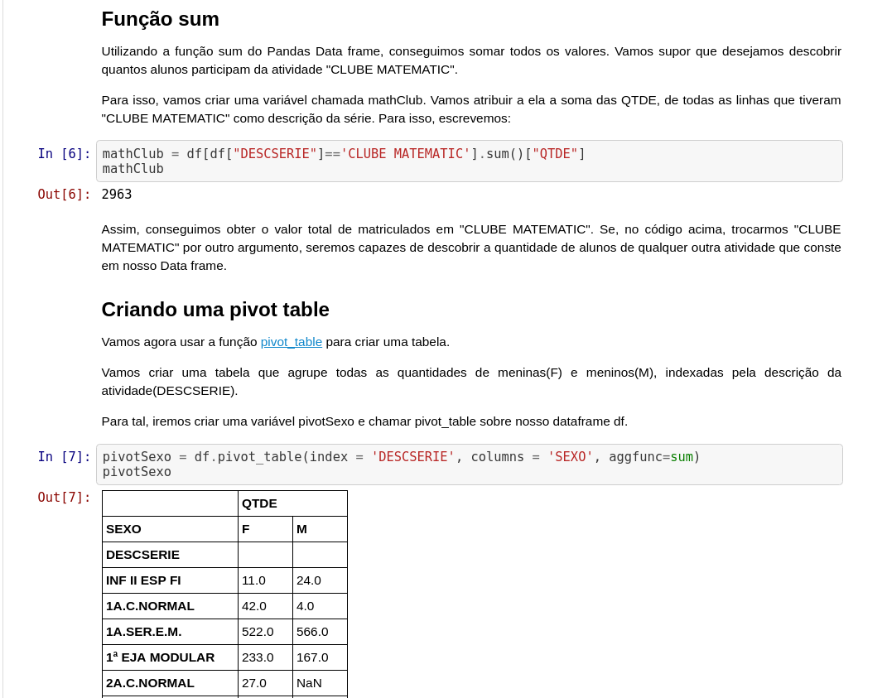

## Mais Pandas	2:12:00
> Continuando tutorial de Pandas. Encontrei diversas dificuldades nesse ponto. Em parte devido a conhecimento insuficiente sobre a biblioteca, o que requereu estudo, mas esbarrei em limitações da plataforma Google colab, o que nos levou a...

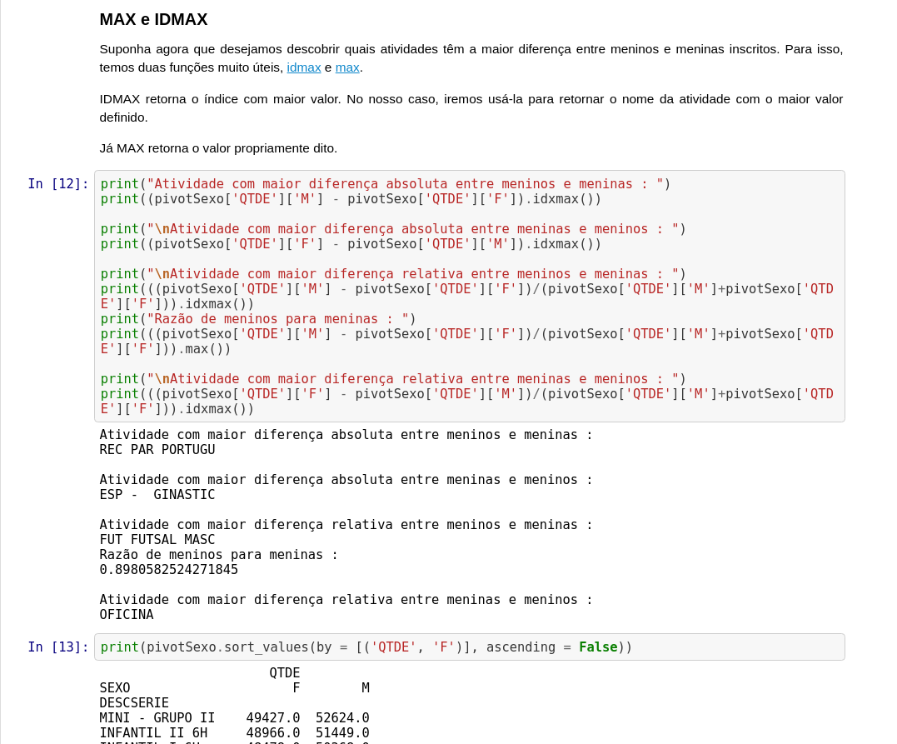

## migrando para Jupyter	3:40:24
> Decidi abandonar o Google Colab e migrar o tutorial para o Jupyter Notebook. Isso requereu que grandes partes do tutorial fossem reescritas, bem como a cópia dos trechos de código para a nova plataforma. Um dos principais problemas encontrados foi a dificuldade em importar os csvs de maneira efetiva, o que acabava gerando diversos _bugs_ e problemas.

## Python Md	4:12:17
> Iniciei um Markdown do tutorial, para ajudar na migração para o Jupyter Notebook. Estudei também a utilização de GIFs, como nos tutoriais de Excel, mas acabei abandonando ambas as ideias e deixando tudo unicamente no Jupyter. Como o Python não possui uma interface gráfica tal qual o Excel, os Gifs não seriam tão interessantes.

## python	2:20:07
> Finalmente com todo o tutorial migrado, foi possível dar continuidade às atividades com o Pandas.

## Tutorial Python - continuação	2:17:48
> Continuação do pacote Pandas

## Palestra Pátio Digital	1:29:44
> Palestra oferecida pelo TECs com a Fernanda do Pátio Digital, que discursou sobre tópicos relevantes ao Python e as bases de dados. Forneceram novas ideias para os tutoriais. A palestra foi ministrada na CCSL.

## matplotlib	2:58:00
> Início dos tutoriais sobre o MatplotLib, com foco em gráfico de Pizza. Procurei aqui fazer algo bastante gradual, mostrando as diversas camadas de complexidade e personalização possível do MatPlotLib, para que o leitor fosse capaz não só de copiar o trecho de código, mas compreendê-lo como um todo.

## Python Gráfico de barras	0:38:09
> Início do tutorial sobre gráfico de barras no MatPlotLib

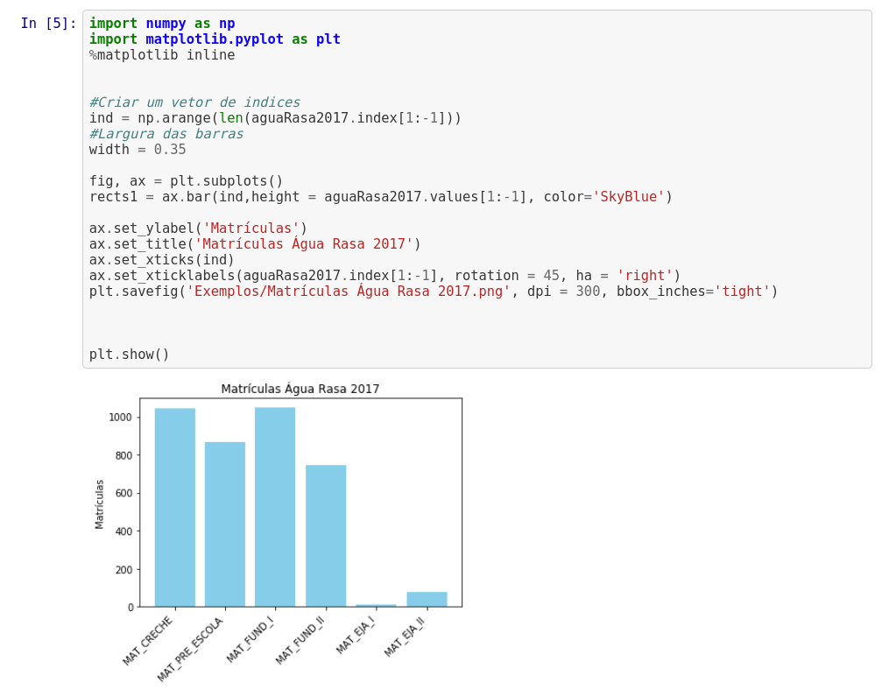

## matplotlib	0:57:58
> Continuação do tutorial sobre gráfico de barras no MatPlotLib

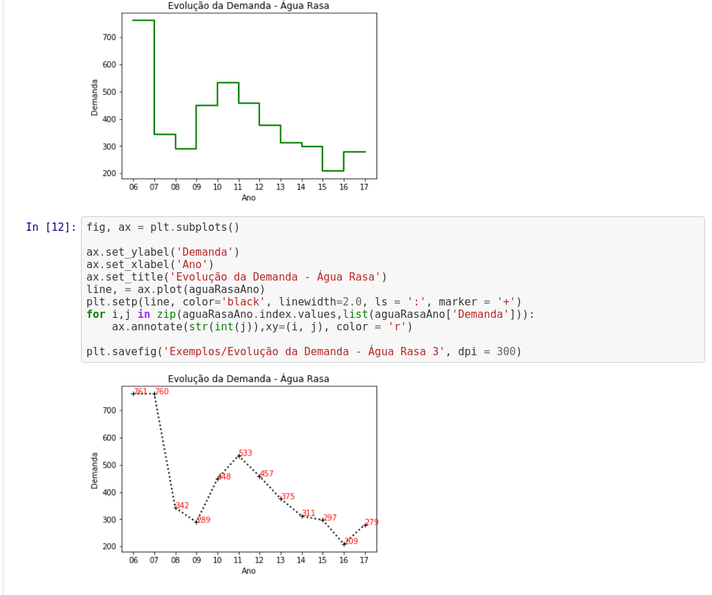

## Revisões de texto	1:30:04
> Revisões de Texto

## Modularizando Tutoriais	0:58:00
> Reestruturei o github como um todo

## revisão Python	0:29:19
> Revisões de texto, ortografia e gramática

## matplot Bar	3:13:50
> Continuação do tutorial sobre gráfico no MatPlotLib

## matplot Bar	2:16:21
> Continuação do tutorial sobre gráfico  no MatPlotLib

## Regex and Groupby	2:05:43
> Tutorial específico sobre Regex e GroupbY. Considerei um tutorial com demonstrações práticas de Regex muito útil, principalmente depois de utilizar muitas bases de dados da SME e perceber as inconsistências presentes, que o Regex pode ser enormemente poderoso para conformar.

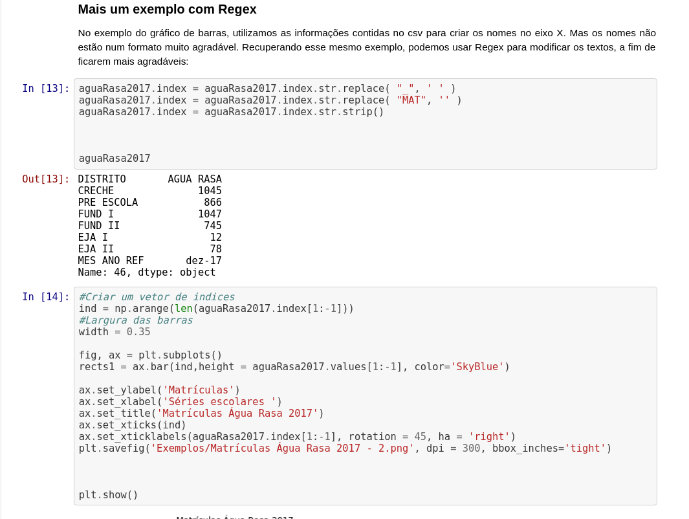

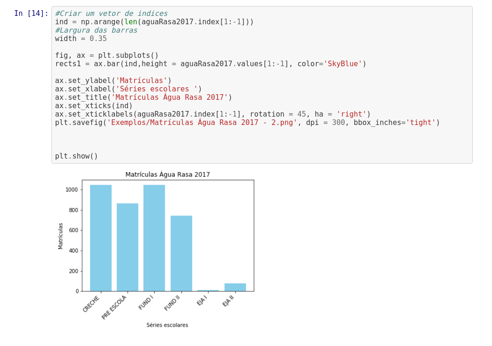

## Modularizando Tutoriais	2:33:21
> Neste ponto, todos os tutoriais estavam em um único arquivo do Jupyter Notebook. Separei em tópicos e colapse blocos de código, reestruturando o tutorial como um todo.

## Correções Ortográficas	2:00:48
> Vide Revisões

## Mais correctos	3:29:17
> Vide Revisões

## Revisão de Texto	2:49:31
> Vide Revisões

## Revisões finais Python	1:20:00
> Vide Revisões

## Exportar Python	0:21:27
> Parte do tutorial, sobre exportar para CSV e Excel

## Novo Tutorial - funções	1:45:37
> Tutorial sobre definições de funções. Considerei este conteúdo um pouco além do escopo dos tutoriais, mas considerei interessante pelas possibilidades que ele permite ao usuário.

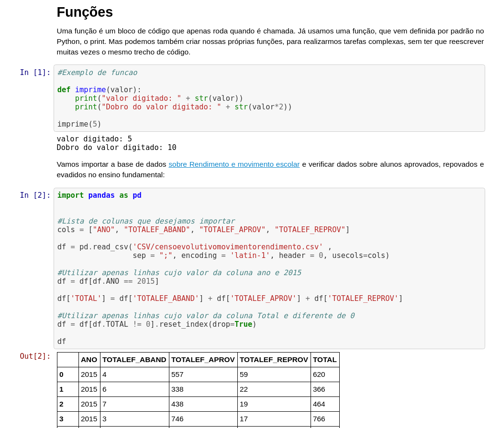

