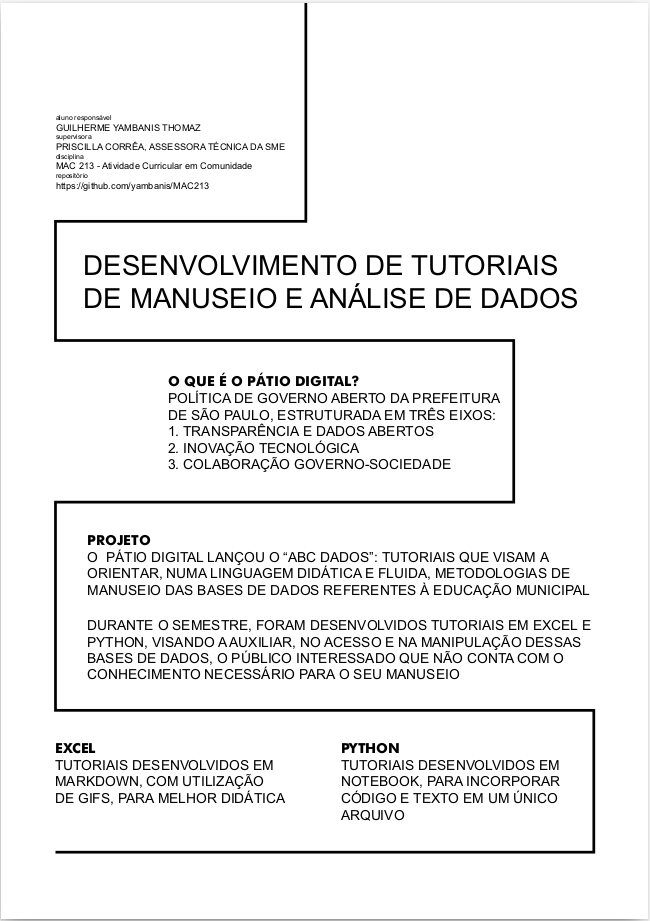
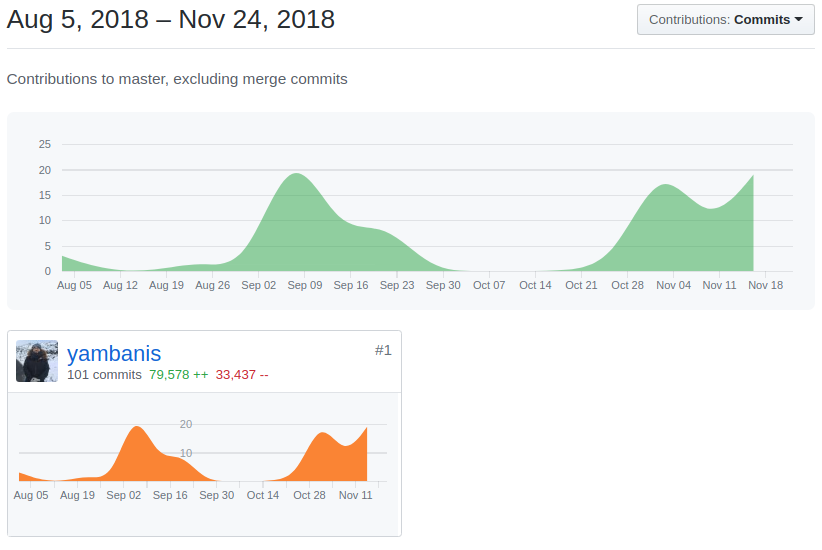
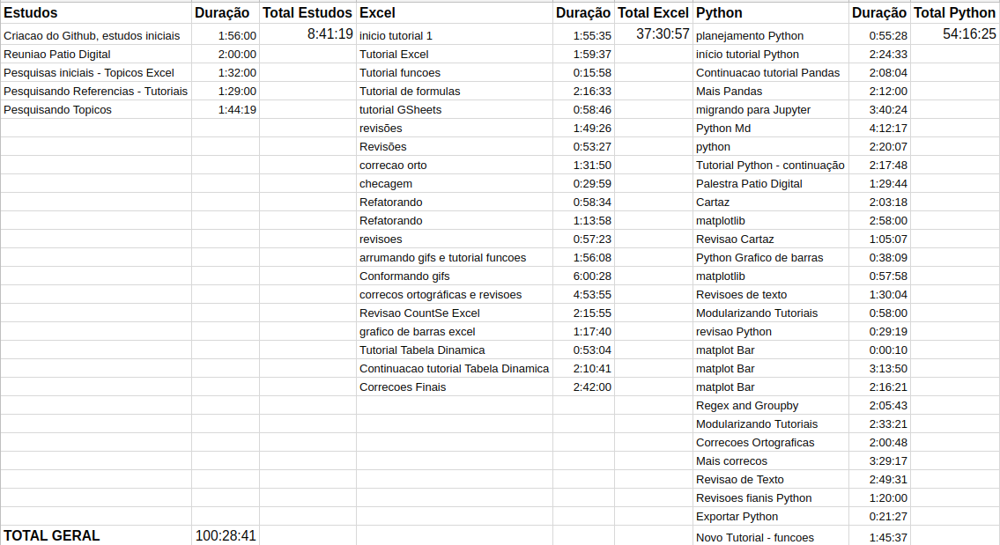

# Relatório Final - MAC213
# Projeto : Desenvolvimento de tutoriais de manuseio e análise de dados
# Guilherme Yambanis Thomaz - 8041265

## Objetivos

Com o intuito de fortalecer a transparência, a SME tem publicado e atualizado um conjunto de bases de dados referentes à educação municipal, variando de planilhas a Microdados. O acesso a tais bases de dados pode ser, muitas vezes, limitado devido à falta de conhecimento para manuseio das bases do público interessado (jornalistas, pesquisadores, integrantes de conselhos escolares). Frente à esse desafio, o Pátio Digital lançou o “ABC Dados”, que consiste na publicação de tutoriais que visam a orientar, numa linguagem didática e fluida, metodologias de manuseio das bases

## Tarefas

Após reunião realizada no dia 31 de agosto com Priscila na sede do Pátio digital, ficou definido que os temas dos tutoriais seriam Excel e Python e que o controle de horas seria feito através da ferramenta Toggl.

Os dez tutoriais a serem realizados ficariam igualmente divididos entre Excel e Python.

Os cinco tutoriais de cada plataforma foram estruturados da seguinte forma:

### Tutoriais Excel

Tutoriais acessíveis em excel para manipulação de dados, em especial arquivos csv

#### Tutorial 1

* O que é uma planilha? 

* Morfologia básica

* Importando conjunto de dados

#### Tutorial 2

* Introdução a funções

* Função SOMA

* Funcao CONT.SE

* Função SE

* Função SOMASE

#### Tutorial 3

* Criando um gráfico de pizza simples

* Customizando o gráfico

#### Tutorial 4

* Google Sheets

* Importando .csv

* Usando funções no Google Sheets

* Criando uma tabela dinâmica no Google Sheets

* Criando um gráfico a partir dos dados

* Função FREQUÊNCIA

#### Tutorial 5

* Criando uma tabela Dinâmica

* Manipulação e visualização dos dados

### Tutoriais Python

Tutoriais criado na plataforma jupyter notebook.

Tópicos abordados:

#### Tutorial 1

* Noções elementares de Python

#### Tutorial 2

* Pacote Pandas

#### Tutorial 3 e 4

* Criando gráficos com matplotlib

#### Tutorial 4

* Regex

#### Tutorial 5

* Definindo funções

## Progresso e desafios

### Excel

Definir inicialmente que os tutoriais seriam escritos em markdown, por ser um formato de fácil exportação, seja para plataforma web ou para pdf, além da possibilidade de inserção de links e fotos.

A construção e definição dos tutoriais tomou um certo tempo, porém, o maior desafio se mostrou na criação dos gifs, que demandam diversas tentativas de ferramentas diferentes.

Além disso, apos a parte técnica finalizada, escrever o texto de forma enxuta e didática também se mostrou algo desafiador. Grande parte da carga horária foi dedicada para refacção e reescrita do texto, a fim de maior clareza e melhor didática.

Como o Excel depende da interação com a interface gráfica, foi necessário bastante texto e os gifs ajudaram muito nesse sentido, comunicando ações mais fáceis de serem traduzidas de maneira visual.

### Python

Já para os tutoriais em Python, preferi o formato Notebook. 

Iniciei os tutoriais usando a plataforma do Google, o Colab. Entretanto, após algum tempo, encontrei diversas dificuldades nessa, com importações incompletas entre outros.

Isso tornou necessário migrar o projeto para o formato Jupyter Notebook. Como ele tambem e renderizado no próprio github, não se mostrou uma perda muito grande neste aspecto, além do ganho em robustez pela execução local do código.

A criação dos tutoriais em python se mostrou mais desafiadora do ponto de vista técnica, exigindo muitas refecções e pesquisa sobre a linguagem.

Certas tarefas propostas por mim mesmo nos tutoriais se mostraram não tão triviais de realizar como eu havia previsto, mas isso permitiu que eu aprimorasse meus conhecimentos de python, bem como a criação dos tutoriais de um ponto de vista mais empático com o leitor, o que, acredito, melhorou a didática.

A junção do código com o texto em um só lugar, graças ao Jupyter Notebook, permitiu a criação de um tutorial muito mais intuitivo, já que o código e sua explicação está lado a lado e o aluno pode roda-lo em tempo real.

## Poster

Poster foi fixado no IME no dia 8 de novembro

## Acompanhamento

O acompanhamento se deu de duas formas principais:

* [Repositorio](https://github.com/yambanis/MAC213) aberto no github, onde todas os arquivos foram salvos durante o semestre

* Controle de horas realizado através da ferramenta Toggl

### Horas despendidas no projeto

### Horas despendidas (detalhado)

